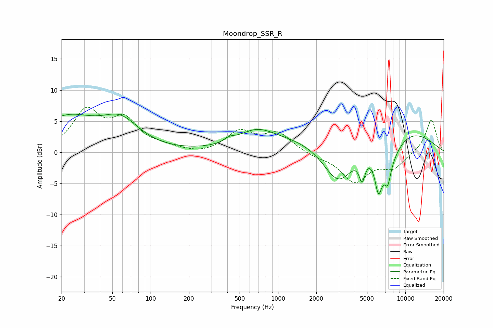

# Moondrop_SSR_R
See [usage instructions](https://github.com/jaakkopasanen/AutoEq#usage) for more options and info.

### Parametric EQs
Apply preamp of -6.3 dB when using parametric equalizer.

|   # | Type    |   Fc (Hz) |    Q |   Gain (dB) |
|-----|---------|-----------|------|-------------|
|   1 | Peaking |        22 | 0.62 |         5.3 |
|   2 | Peaking |        58 | 0.97 |         4.2 |
|   3 | Peaking |       417 | 3.81 |         0.6 |
|   4 | Peaking |       674 | 0.94 |         2.8 |
|   5 | Peaking |      3007 | 0.92 |       -10.2 |
|   6 | Peaking |      4577 | 6    |        -3.6 |
|   7 | Peaking |      4825 | 0.27 |         7.2 |
|   8 | Peaking |      6145 | 5.01 |        -4.9 |
|   9 | Peaking |      7111 | 1.34 |        -6.2 |
|  10 | Peaking |      7266 | 5.99 |        -2.7 |

### Fixed Band EQs
When using fixed band (also called graphic) equalizer, apply preamp of **-7.4 dB** (if available) and set gains manually with these parameters.

|   # | Type    |   Fc (Hz) |    Q |   Gain (dB) |
|-----|---------|-----------|------|-------------|
|   1 | Peaking |        31 | 1.41 |         6.3 |
|   2 | Peaking |        62 | 1.41 |         4.7 |
|   3 | Peaking |       125 | 1.41 |         0.6 |
|   4 | Peaking |       250 | 1.41 |        -0.4 |
|   5 | Peaking |       500 | 1.41 |         3.2 |
|   6 | Peaking |      1000 | 1.41 |         3   |
|   7 | Peaking |      2000 | 1.41 |        -0.6 |
|   8 | Peaking |      4000 | 1.41 |        -4.6 |
|   9 | Peaking |      8000 | 1.41 |        -2.3 |
|  10 | Peaking |     16000 | 1.41 |         5.4 |

### Graphs

