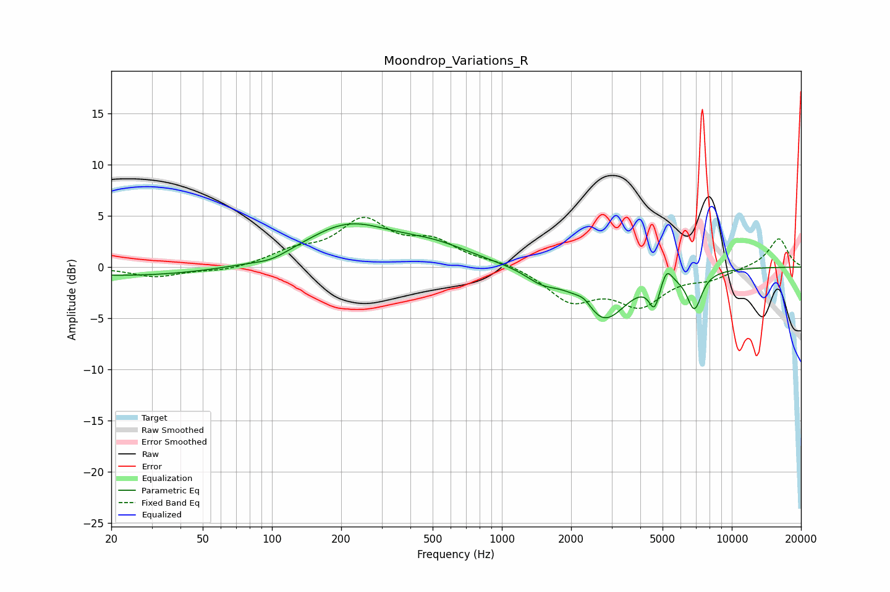

# Moondrop_Variations_R
See [usage instructions](https://github.com/jaakkopasanen/AutoEq#usage) for more options and info.

### Parametric EQs
Apply preamp of -4.3 dB when using parametric equalizer.

|   # | Type    |   Fc (Hz) |    Q |   Gain (dB) |
|-----|---------|-----------|------|-------------|
|   1 | Peaking |        25 | 0.36 |        -0.9 |
|   2 | Peaking |        99 | 1.96 |        -0.5 |
|   3 | Peaking |       213 | 0.73 |         3.9 |
|   4 | Peaking |       509 | 0.83 |         1.6 |
|   5 | Peaking |      1489 | 2.03 |        -1.1 |
|   6 | Peaking |      2283 | 4.04 |         0.8 |
|   7 | Peaking |      2779 | 1.39 |        -5.1 |
|   8 | Peaking |      4609 | 6    |        -2.6 |
|   9 | Peaking |      5206 | 6    |         1.5 |
|  10 | Peaking |      6877 | 4.25 |        -3.6 |

### Fixed Band EQs
When using fixed band (also called graphic) equalizer, apply preamp of **-5.0 dB** (if available) and set gains manually with these parameters.

|   # | Type    |   Fc (Hz) |    Q |   Gain (dB) |
|-----|---------|-----------|------|-------------|
|   1 | Peaking |        31 | 1.41 |        -0.9 |
|   2 | Peaking |        62 | 1.41 |        -0.4 |
|   3 | Peaking |       125 | 1.41 |         1.3 |
|   4 | Peaking |       250 | 1.41 |         4.2 |
|   5 | Peaking |       500 | 1.41 |         2.2 |
|   6 | Peaking |      1000 | 1.41 |         0.5 |
|   7 | Peaking |      2000 | 1.41 |        -3.1 |
|   8 | Peaking |      4000 | 1.41 |        -3.4 |
|   9 | Peaking |      8000 | 1.41 |        -1   |
|  10 | Peaking |     16000 | 1.41 |         2.9 |

### Graphs

