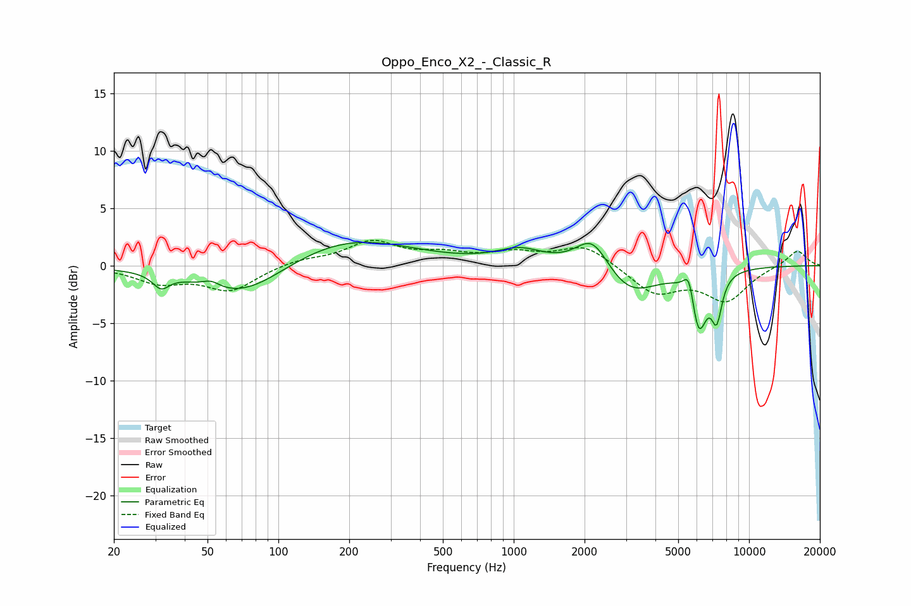

# Oppo_Enco_X2_-_Classic_R
See [usage instructions](https://github.com/jaakkopasanen/AutoEq#usage) for more options and info.

### Parametric EQs
Apply preamp of -2.1 dB when using parametric equalizer.

|   # | Type    |   Fc (Hz) |    Q |   Gain (dB) |
|-----|---------|-----------|------|-------------|
|   1 | Peaking |        32 | 4.12 |        -1.2 |
|   2 | Peaking |        52 | 4    |         0.6 |
|   3 | Peaking |        70 | 0.77 |        -3   |
|   4 | Peaking |       194 | 0.53 |         2.6 |
|   5 | Peaking |      1063 | 1.42 |         1.3 |
|   6 | Peaking |      2165 | 1.97 |         3.1 |
|   7 | Peaking |      3086 | 1.21 |        -2.7 |
|   8 | Peaking |      5574 | 6    |         2.6 |
|   9 | Peaking |      6092 | 3.93 |        -5.5 |
|  10 | Peaking |      7287 | 6    |        -3.6 |

### Fixed Band EQs
When using fixed band (also called graphic) equalizer, apply preamp of **-2.3 dB** (if available) and set gains manually with these parameters.

|   # | Type    |   Fc (Hz) |    Q |   Gain (dB) |
|-----|---------|-----------|------|-------------|
|   1 | Peaking |        31 | 1.41 |        -1.4 |
|   2 | Peaking |        62 | 1.41 |        -2.1 |
|   3 | Peaking |       125 | 1.41 |         0.5 |
|   4 | Peaking |       250 | 1.41 |         2   |
|   5 | Peaking |       500 | 1.41 |         0.8 |
|   6 | Peaking |      1000 | 1.41 |         1   |
|   7 | Peaking |      2000 | 1.41 |         1.8 |
|   8 | Peaking |      4000 | 1.41 |        -2.4 |
|   9 | Peaking |      8000 | 1.41 |        -2.9 |
|  10 | Peaking |     16000 | 1.41 |         1.4 |

### Graphs

