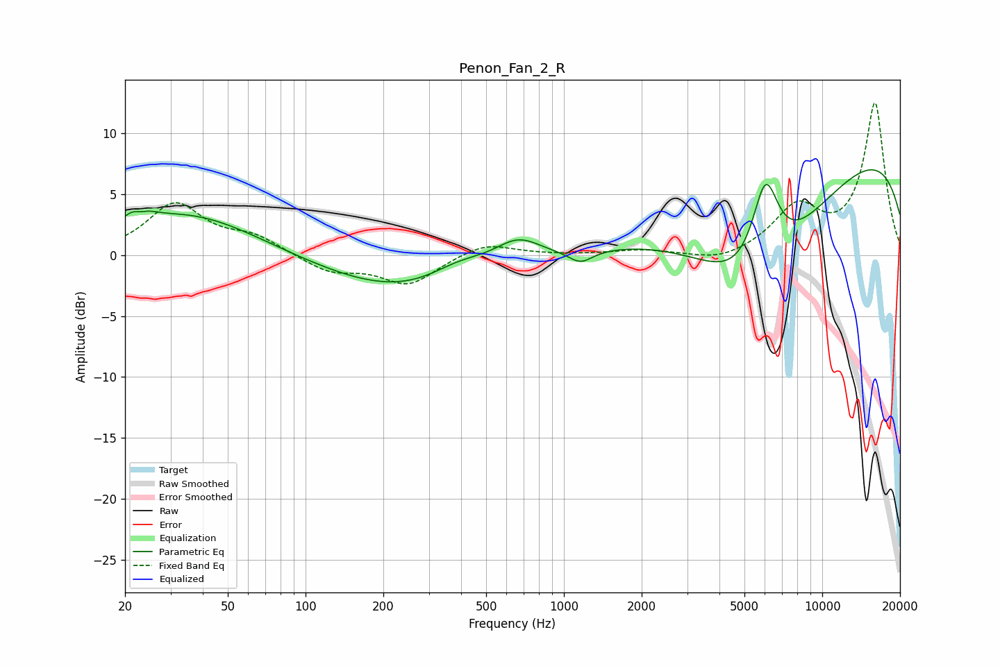

# Penon_Fan_2_R
See [usage instructions](https://github.com/jaakkopasanen/AutoEq#usage) for more options and info.

### Parametric EQs
Apply preamp of -7.1 dB when using parametric equalizer.

|   # | Type    |   Fc (Hz) |    Q |   Gain (dB) |
|-----|---------|-----------|------|-------------|
|   1 | Peaking |        23 | 3.56 |         3.2 |
|   2 | Peaking |        23 | 4.43 |        -2.3 |
|   3 | Peaking |        35 | 0.53 |         3.4 |
|   4 | Peaking |       289 | 0.4  |        -3.5 |
|   5 | Peaking |       393 | 1.13 |         1.9 |
|   6 | Peaking |       662 | 1.46 |         2.4 |
|   7 | Peaking |      1161 | 3.08 |        -1   |
|   8 | Peaking |      5509 | 0.53 |       -11.9 |
|   9 | Peaking |      6023 | 2.51 |         7.8 |
|  10 | Peaking |      9712 | 0.18 |        10.3 |

### Fixed Band EQs
When using fixed band (also called graphic) equalizer, apply preamp of **-12.6 dB** (if available) and set gains manually with these parameters.

|   # | Type    |   Fc (Hz) |    Q |   Gain (dB) |
|-----|---------|-----------|------|-------------|
|   1 | Peaking |        31 | 1.41 |         4.1 |
|   2 | Peaking |        62 | 1.41 |         1.4 |
|   3 | Peaking |       125 | 1.41 |        -1.4 |
|   4 | Peaking |       250 | 1.41 |        -2.4 |
|   5 | Peaking |       500 | 1.41 |         1.1 |
|   6 | Peaking |      1000 | 1.41 |         0   |
|   7 | Peaking |      2000 | 1.41 |         0.4 |
|   8 | Peaking |      4000 | 1.41 |        -0.7 |
|   9 | Peaking |      8000 | 1.41 |         3.7 |
|  10 | Peaking |     16000 | 1.41 |        12.4 |

### Graphs

