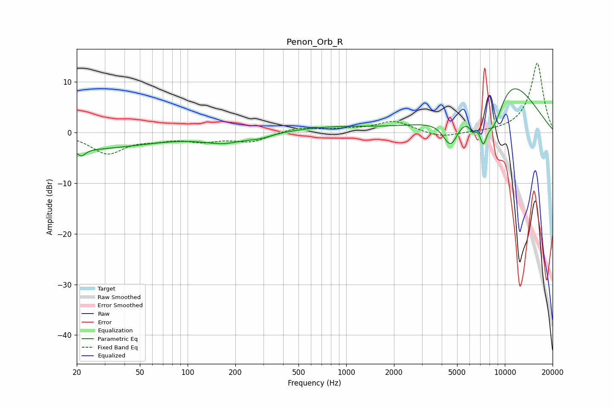

# Penon_Orb_R
See [usage instructions](https://github.com/jaakkopasanen/AutoEq#usage) for more options and info.

### Parametric EQs
Apply preamp of -8.8 dB when using parametric equalizer.

|   # | Type    |   Fc (Hz) |    Q |   Gain (dB) |
|-----|---------|-----------|------|-------------|
|   1 | Peaking |        20 | 0.31 |        -3.2 |
|   2 | Peaking |        21 | 5.71 |        -1.3 |
|   3 | Peaking |       169 | 1.06 |        -1.7 |
|   4 | Peaking |       288 | 1.89 |        -0.7 |
|   5 | Peaking |       858 | 0.52 |         1.1 |
|   6 | Peaking |      4558 | 2.76 |        -5.8 |
|   7 | Peaking |      6294 | 5.94 |        -2.5 |
|   8 | Peaking |      7305 | 5.66 |        -5   |
|   9 | Peaking |      8555 | 1.74 |        -8.9 |
|  10 | Peaking |     10000 | 0.59 |        12.7 |

### Fixed Band EQs
When using fixed band (also called graphic) equalizer, apply preamp of **-13.8 dB** (if available) and set gains manually with these parameters.

|   # | Type    |   Fc (Hz) |    Q |   Gain (dB) |
|-----|---------|-----------|------|-------------|
|   1 | Peaking |        31 | 1.41 |        -4   |
|   2 | Peaking |        62 | 1.41 |        -1   |
|   3 | Peaking |       125 | 1.41 |        -1.4 |
|   4 | Peaking |       250 | 1.41 |        -1.7 |
|   5 | Peaking |       500 | 1.41 |         1   |
|   6 | Peaking |      1000 | 1.41 |         0.5 |
|   7 | Peaking |      2000 | 1.41 |         2.2 |
|   8 | Peaking |      4000 | 1.41 |        -1.1 |
|   9 | Peaking |      8000 | 1.41 |        -0   |
|  10 | Peaking |     16000 | 1.41 |        13.8 |

### Graphs

