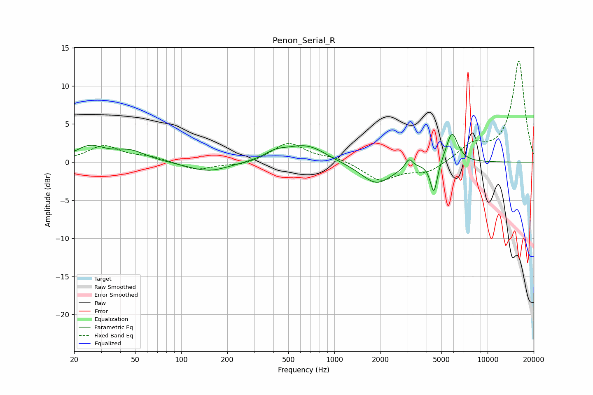

# Penon_Serial_R
See [usage instructions](https://github.com/jaakkopasanen/AutoEq#usage) for more options and info.

### Parametric EQs
Apply preamp of -3.7 dB when using parametric equalizer.

|   # | Type    |   Fc (Hz) |    Q |   Gain (dB) |
|-----|---------|-----------|------|-------------|
|   1 | Peaking |        25 | 1.5  |         1.9 |
|   2 | Peaking |        46 | 1.37 |         1.3 |
|   3 | Peaking |       150 | 1.06 |        -1.3 |
|   4 | Peaking |       413 | 1.96 |         0.9 |
|   5 | Peaking |       633 | 1.14 |         2.1 |
|   6 | Peaking |       782 | 2.06 |         0.2 |
|   7 | Peaking |      1887 | 1.37 |        -2.9 |
|   8 | Peaking |      3068 | 6    |         1.2 |
|   9 | Peaking |      4460 | 6    |        -4.2 |
|  10 | Peaking |      5857 | 3.6  |         4.1 |

### Fixed Band EQs
When using fixed band (also called graphic) equalizer, apply preamp of **-13.4 dB** (if available) and set gains manually with these parameters.

|   # | Type    |   Fc (Hz) |    Q |   Gain (dB) |
|-----|---------|-----------|------|-------------|
|   1 | Peaking |        31 | 1.41 |         2.1 |
|   2 | Peaking |        62 | 1.41 |         0.6 |
|   3 | Peaking |       125 | 1.41 |        -1.1 |
|   4 | Peaking |       250 | 1.41 |        -0.5 |
|   5 | Peaking |       500 | 1.41 |         2.5 |
|   6 | Peaking |      1000 | 1.41 |         0.6 |
|   7 | Peaking |      2000 | 1.41 |        -2.4 |
|   8 | Peaking |      4000 | 1.41 |        -1.4 |
|   9 | Peaking |      8000 | 1.41 |         2.1 |
|  10 | Peaking |     16000 | 1.41 |        13.3 |

### Graphs

