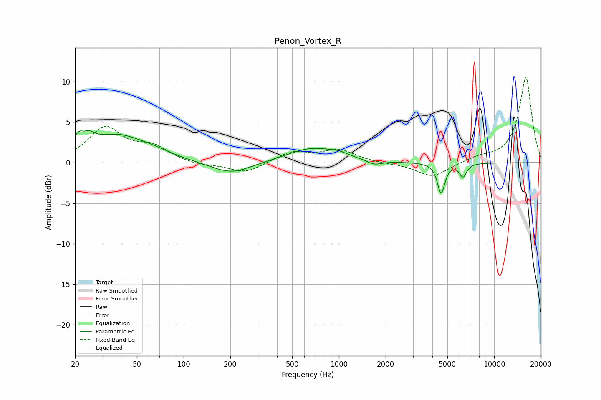

# Penon_Vortex_R
See [usage instructions](https://github.com/jaakkopasanen/AutoEq#usage) for more options and info.

### Parametric EQs
Apply preamp of -4.1 dB when using parametric equalizer.

|   # | Type    |   Fc (Hz) |    Q |   Gain (dB) |
|-----|---------|-----------|------|-------------|
|   1 | Peaking |        22 | 3.01 |         3.8 |
|   2 | Peaking |        23 | 5.48 |        -1.6 |
|   3 | Peaking |        37 | 0.89 |         2.9 |
|   4 | Peaking |        64 | 1.12 |         0.8 |
|   5 | Peaking |       203 | 1.12 |        -1.5 |
|   6 | Peaking |       672 | 0.89 |         1.8 |
|   7 | Peaking |      1004 | 2.35 |         0.4 |
|   8 | Peaking |      1696 | 3    |        -0.6 |
|   9 | Peaking |      4552 | 6    |        -3.7 |
|  10 | Peaking |      6301 | 6    |        -1.6 |

### Fixed Band EQs
When using fixed band (also called graphic) equalizer, apply preamp of **-10.6 dB** (if available) and set gains manually with these parameters.

|   # | Type    |   Fc (Hz) |    Q |   Gain (dB) |
|-----|---------|-----------|------|-------------|
|   1 | Peaking |        31 | 1.41 |         4.2 |
|   2 | Peaking |        62 | 1.41 |         1.7 |
|   3 | Peaking |       125 | 1.41 |        -0.4 |
|   4 | Peaking |       250 | 1.41 |        -1.3 |
|   5 | Peaking |       500 | 1.41 |         1.3 |
|   6 | Peaking |      1000 | 1.41 |         1.5 |
|   7 | Peaking |      2000 | 1.41 |        -0.1 |
|   8 | Peaking |      4000 | 1.41 |        -1.8 |
|   9 | Peaking |      8000 | 1.41 |         0.6 |
|  10 | Peaking |     16000 | 1.41 |        10.5 |

### Graphs

