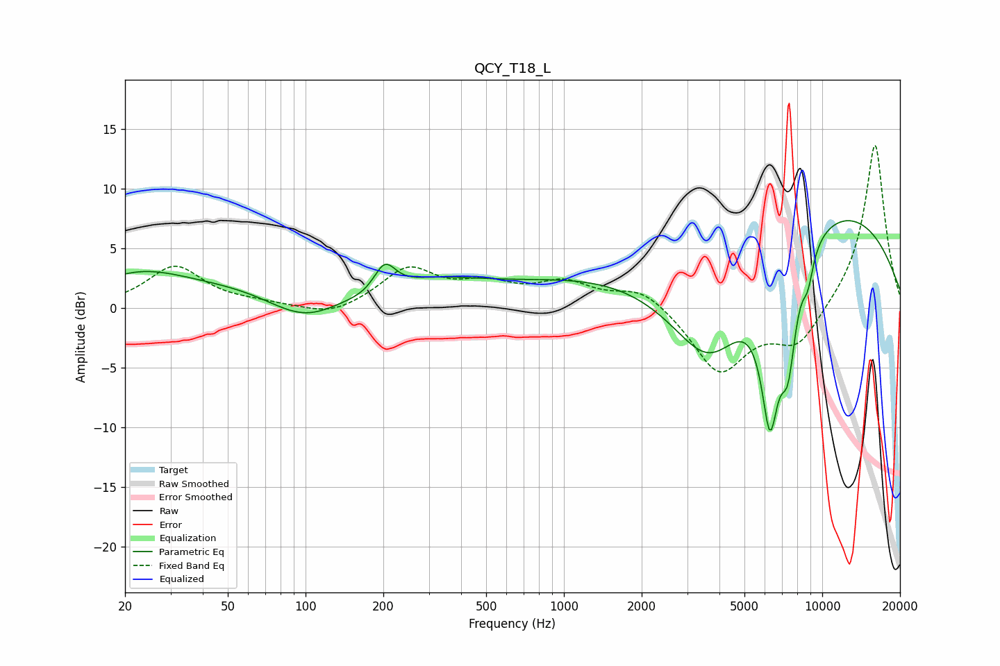

# QCY_T18_L
See [usage instructions](https://github.com/jaakkopasanen/AutoEq#usage) for more options and info.

### Parametric EQs
Apply preamp of -7.4 dB when using parametric equalizer.

|   # | Type    |   Fc (Hz) |    Q |   Gain (dB) |
|-----|---------|-----------|------|-------------|
|   1 | Peaking |        23 | 0.76 |         2.4 |
|   2 | Peaking |       102 | 0.75 |        -6.3 |
|   3 | Peaking |       129 | 0.39 |         6.4 |
|   4 | Peaking |       191 | 1.16 |        -2.2 |
|   5 | Peaking |       202 | 3.21 |         2.8 |
|   6 | Peaking |      3667 | 0.62 |       -14.7 |
|   7 | Peaking |      6107 | 0.2  |        12.6 |
|   8 | Peaking |      6279 | 3.61 |       -11.8 |
|   9 | Peaking |      7374 | 4.15 |        -7.2 |
|  10 | Peaking |      8791 | 5.74 |        -2.4 |

### Fixed Band EQs
When using fixed band (also called graphic) equalizer, apply preamp of **-13.7 dB** (if available) and set gains manually with these parameters.

|   # | Type    |   Fc (Hz) |    Q |   Gain (dB) |
|-----|---------|-----------|------|-------------|
|   1 | Peaking |        31 | 1.41 |         3.4 |
|   2 | Peaking |        62 | 1.41 |         0.3 |
|   3 | Peaking |       125 | 1.41 |        -0.9 |
|   4 | Peaking |       250 | 1.41 |         3.2 |
|   5 | Peaking |       500 | 1.41 |         1.6 |
|   6 | Peaking |      1000 | 1.41 |         1.9 |
|   7 | Peaking |      2000 | 1.41 |         1.7 |
|   8 | Peaking |      4000 | 1.41 |        -5.5 |
|   9 | Peaking |      8000 | 1.41 |        -3.2 |
|  10 | Peaking |     16000 | 1.41 |        13.9 |

### Graphs

