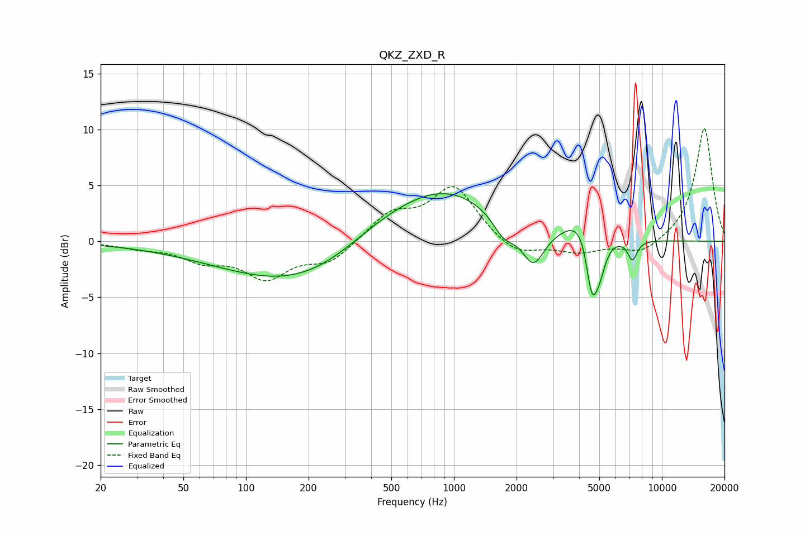

# QKZ_ZXD_R
See [usage instructions](https://github.com/jaakkopasanen/AutoEq#usage) for more options and info.

### Parametric EQs
Apply preamp of -4.4 dB when using parametric equalizer.

|   # | Type    |   Fc (Hz) |    Q |   Gain (dB) |
|-----|---------|-----------|------|-------------|
|   1 | Peaking |        83 | 0.39 |        -0.6 |
|   2 | Peaking |       211 | 0.4  |        -3.9 |
|   3 | Peaking |       419 | 0.65 |         1.9 |
|   4 | Peaking |       897 | 0.54 |         4.7 |
|   5 | Peaking |      1740 | 2.56 |        -1.8 |
|   6 | Peaking |      2406 | 2.58 |        -3.5 |
|   7 | Peaking |      4204 | 1.86 |         2.5 |
|   8 | Peaking |      4596 | 4.85 |        -5.3 |
|   9 | Peaking |      5000 | 4.27 |        -2.8 |
|  10 | Peaking |      7218 | 6    |        -1.8 |

### Fixed Band EQs
When using fixed band (also called graphic) equalizer, apply preamp of **-10.2 dB** (if available) and set gains manually with these parameters.

|   # | Type    |   Fc (Hz) |    Q |   Gain (dB) |
|-----|---------|-----------|------|-------------|
|   1 | Peaking |        31 | 1.41 |        -0.5 |
|   2 | Peaking |        62 | 1.41 |        -1.5 |
|   3 | Peaking |       125 | 1.41 |        -3   |
|   4 | Peaking |       250 | 1.41 |        -1.8 |
|   5 | Peaking |       500 | 1.41 |         2.3 |
|   6 | Peaking |      1000 | 1.41 |         4.8 |
|   7 | Peaking |      2000 | 1.41 |        -1.4 |
|   8 | Peaking |      4000 | 1.41 |        -0.9 |
|   9 | Peaking |      8000 | 1.41 |        -1.2 |
|  10 | Peaking |     16000 | 1.41 |        10.2 |

### Graphs

