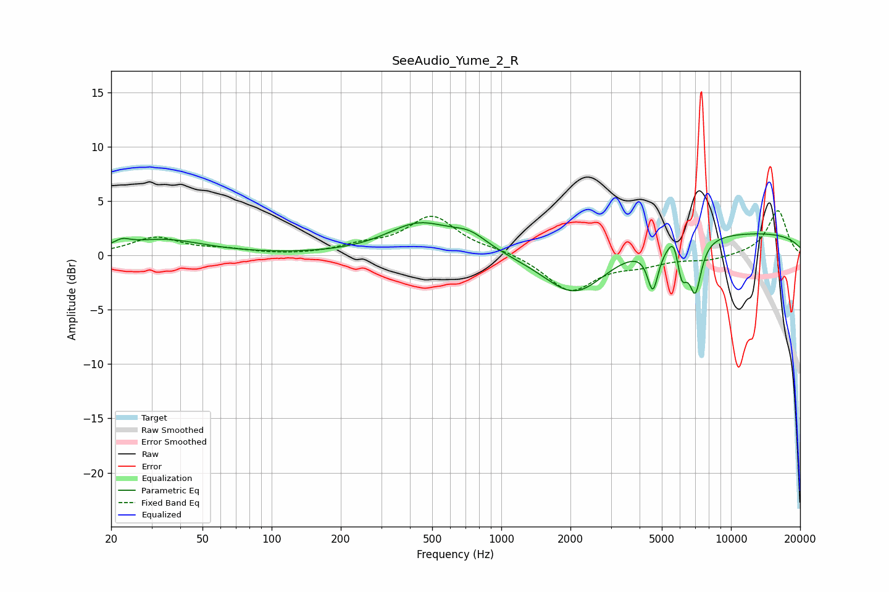

# SeeAudio_Yume_2_R
See [usage instructions](https://github.com/jaakkopasanen/AutoEq#usage) for more options and info.

### Parametric EQs
Apply preamp of -3.1 dB when using parametric equalizer.

|   # | Type    |   Fc (Hz) |    Q |   Gain (dB) |
|-----|---------|-----------|------|-------------|
|   1 | Peaking |        22 | 4.18 |         0.5 |
|   2 | Peaking |        33 | 0.79 |         1.4 |
|   3 | Peaking |       438 | 1    |         2.8 |
|   4 | Peaking |       729 | 1.75 |         1.3 |
|   5 | Peaking |      2100 | 1.01 |        -4.5 |
|   6 | Peaking |      4570 | 6    |        -3.8 |
|   7 | Peaking |      5696 | 5.27 |         2.3 |
|   8 | Peaking |      6081 | 5.78 |        -3.7 |
|   9 | Peaking |      6995 | 5.15 |        -4.6 |
|  10 | Peaking |      9901 | 0.18 |         2.1 |

### Fixed Band EQs
When using fixed band (also called graphic) equalizer, apply preamp of **-4.2 dB** (if available) and set gains manually with these parameters.

|   # | Type    |   Fc (Hz) |    Q |   Gain (dB) |
|-----|---------|-----------|------|-------------|
|   1 | Peaking |        31 | 1.41 |         1.6 |
|   2 | Peaking |        62 | 1.41 |         0.4 |
|   3 | Peaking |       125 | 1.41 |        -0.1 |
|   4 | Peaking |       250 | 1.41 |         0.7 |
|   5 | Peaking |       500 | 1.41 |         3.5 |
|   6 | Peaking |      1000 | 1.41 |         0.4 |
|   7 | Peaking |      2000 | 1.41 |        -3.3 |
|   8 | Peaking |      4000 | 1.41 |        -0.7 |
|   9 | Peaking |      8000 | 1.41 |        -0.4 |
|  10 | Peaking |     16000 | 1.41 |         4.2 |

### Graphs

