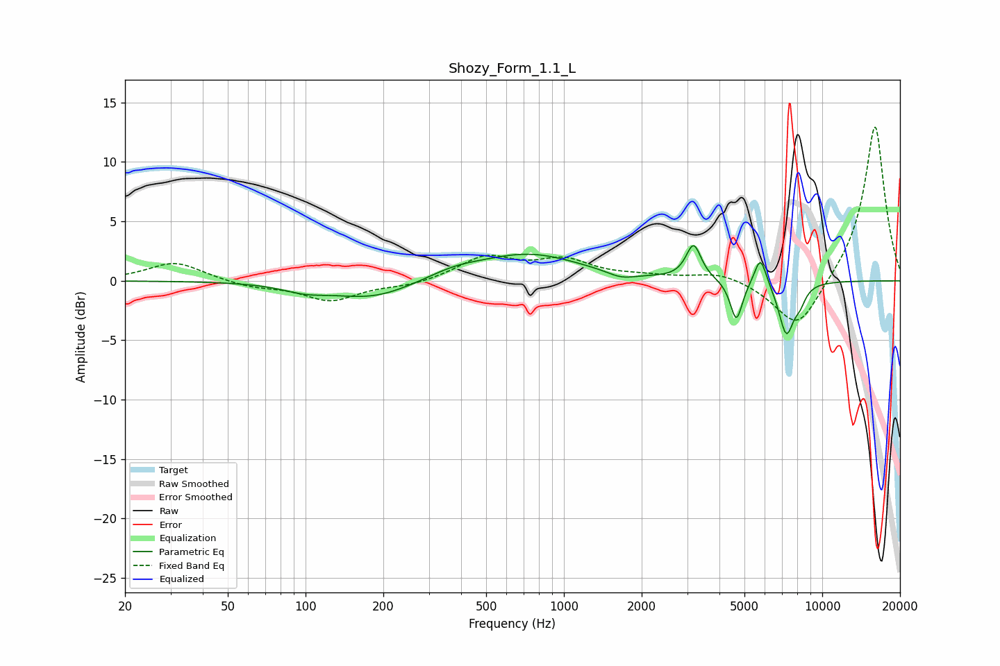

# Shozy_Form_1.1_L
See [usage instructions](https://github.com/jaakkopasanen/AutoEq#usage) for more options and info.

### Parametric EQs
Apply preamp of -3.1 dB when using parametric equalizer.

|   # | Type    |   Fc (Hz) |    Q |   Gain (dB) |
|-----|---------|-----------|------|-------------|
|   1 | Peaking |        99 | 1.61 |        -0.6 |
|   2 | Peaking |       182 | 0.9  |        -1.5 |
|   3 | Peaking |       377 | 1.36 |         0.6 |
|   4 | Peaking |       728 | 0.7  |         2.2 |
|   5 | Peaking |      1668 | 2.62 |        -0.5 |
|   6 | Peaking |      3177 | 4.89 |         2.9 |
|   7 | Peaking |      4650 | 6    |        -3.4 |
|   8 | Peaking |      5765 | 5.94 |         2.5 |
|   9 | Peaking |      7264 | 4.48 |        -4.4 |
|  10 | Peaking |      8202 | 6    |        -1   |

### Fixed Band EQs
When using fixed band (also called graphic) equalizer, apply preamp of **-13.0 dB** (if available) and set gains manually with these parameters.

|   # | Type    |   Fc (Hz) |    Q |   Gain (dB) |
|-----|---------|-----------|------|-------------|
|   1 | Peaking |        31 | 1.41 |         1.6 |
|   2 | Peaking |        62 | 1.41 |        -0.5 |
|   3 | Peaking |       125 | 1.41 |        -1.6 |
|   4 | Peaking |       250 | 1.41 |        -0.4 |
|   5 | Peaking |       500 | 1.41 |         1.9 |
|   6 | Peaking |      1000 | 1.41 |         1.6 |
|   7 | Peaking |      2000 | 1.41 |         0.3 |
|   8 | Peaking |      4000 | 1.41 |         0.7 |
|   9 | Peaking |      8000 | 1.41 |        -4.3 |
|  10 | Peaking |     16000 | 1.41 |        13.3 |

### Graphs

