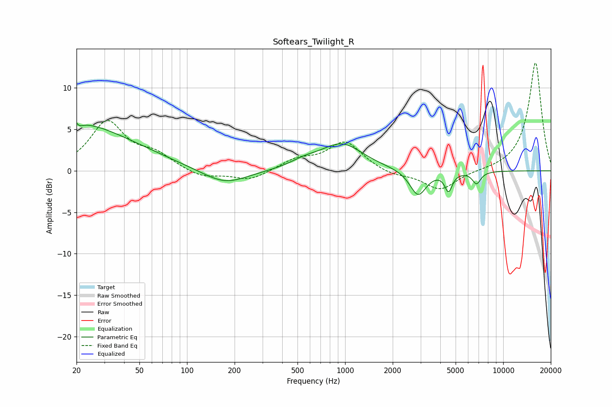

# Softears_Twilight_R
See [usage instructions](https://github.com/jaakkopasanen/AutoEq#usage) for more options and info.

### Parametric EQs
Apply preamp of -5.9 dB when using parametric equalizer.

|   # | Type    |   Fc (Hz) |    Q |   Gain (dB) |
|-----|---------|-----------|------|-------------|
|   1 | Peaking |        20 | 0.58 |         4.8 |
|   2 | Peaking |        20 | 6    |         3.8 |
|   3 | Peaking |        20 | 6    |        -3.6 |
|   4 | Peaking |        45 | 0.54 |         1.5 |
|   5 | Peaking |       174 | 1    |        -1.8 |
|   6 | Peaking |       550 | 1.56 |         0.7 |
|   7 | Peaking |       953 | 1.05 |         3.2 |
|   8 | Peaking |      2894 | 2.72 |        -3.1 |
|   9 | Peaking |      4510 | 6    |        -2.2 |
|  10 | Peaking |      6782 | 5.12 |        -1.5 |

### Fixed Band EQs
When using fixed band (also called graphic) equalizer, apply preamp of **-13.1 dB** (if available) and set gains manually with these parameters.

|   # | Type    |   Fc (Hz) |    Q |   Gain (dB) |
|-----|---------|-----------|------|-------------|
|   1 | Peaking |        31 | 1.41 |         5.8 |
|   2 | Peaking |        62 | 1.41 |         1.7 |
|   3 | Peaking |       125 | 1.41 |        -0.9 |
|   4 | Peaking |       250 | 1.41 |        -1.2 |
|   5 | Peaking |       500 | 1.41 |         1.3 |
|   6 | Peaking |      1000 | 1.41 |         3.4 |
|   7 | Peaking |      2000 | 1.41 |        -0.6 |
|   8 | Peaking |      4000 | 1.41 |        -2.3 |
|   9 | Peaking |      8000 | 1.41 |        -0   |
|  10 | Peaking |     16000 | 1.41 |        13.1 |

### Graphs

