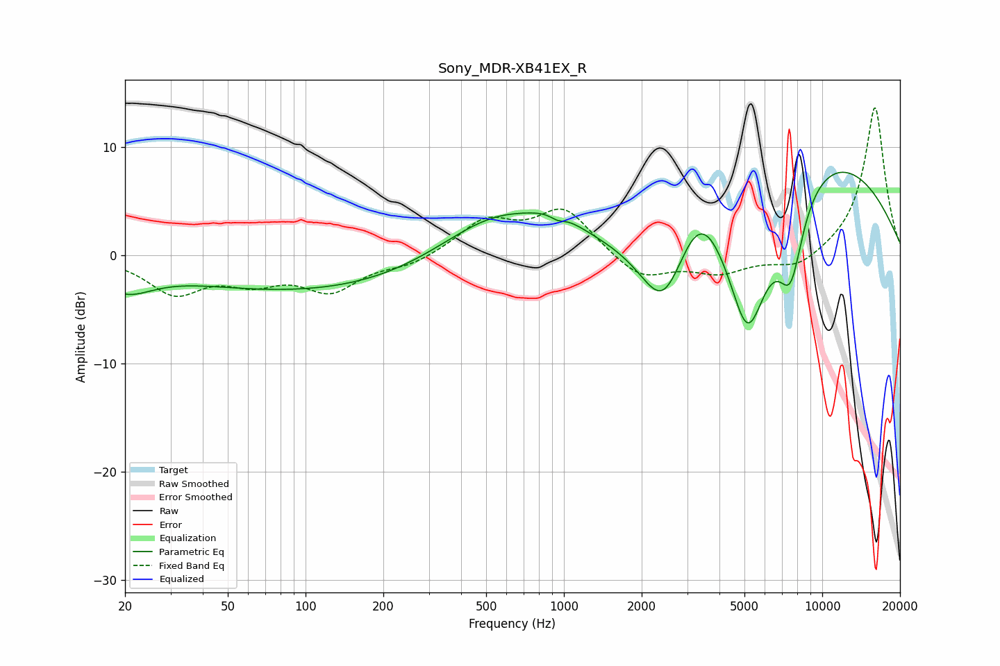

# Sony_MDR-XB41EX_R
See [usage instructions](https://github.com/jaakkopasanen/AutoEq#usage) for more options and info.

### Parametric EQs
Apply preamp of -7.8 dB when using parametric equalizer.

|   # | Type    |   Fc (Hz) |    Q |   Gain (dB) |
|-----|---------|-----------|------|-------------|
|   1 | Peaking |        20 | 1.34 |        -2.5 |
|   2 | Peaking |       129 | 0.23 |        -3.6 |
|   3 | Peaking |       542 | 0.6  |         5.1 |
|   4 | Peaking |       944 | 4.59 |        -0.6 |
|   5 | Peaking |       944 | 1.57 |         1.4 |
|   6 | Peaking |      2442 | 1.41 |        -8.6 |
|   7 | Peaking |      3337 | 1.34 |         6.2 |
|   8 | Peaking |      5143 | 1.4  |       -15.1 |
|   9 | Peaking |      7546 | 2.71 |        -7.2 |
|  10 | Peaking |      8737 | 0.32 |        10.7 |

### Fixed Band EQs
When using fixed band (also called graphic) equalizer, apply preamp of **-13.7 dB** (if available) and set gains manually with these parameters.

|   # | Type    |   Fc (Hz) |    Q |   Gain (dB) |
|-----|---------|-----------|------|-------------|
|   1 | Peaking |        31 | 1.41 |        -3.3 |
|   2 | Peaking |        62 | 1.41 |        -2   |
|   3 | Peaking |       125 | 1.41 |        -3.1 |
|   4 | Peaking |       250 | 1.41 |        -0.9 |
|   5 | Peaking |       500 | 1.41 |         3.1 |
|   6 | Peaking |      1000 | 1.41 |         4.2 |
|   7 | Peaking |      2000 | 1.41 |        -2.3 |
|   8 | Peaking |      4000 | 1.41 |        -1.6 |
|   9 | Peaking |      8000 | 1.41 |        -1.4 |
|  10 | Peaking |     16000 | 1.41 |        13.8 |

### Graphs

