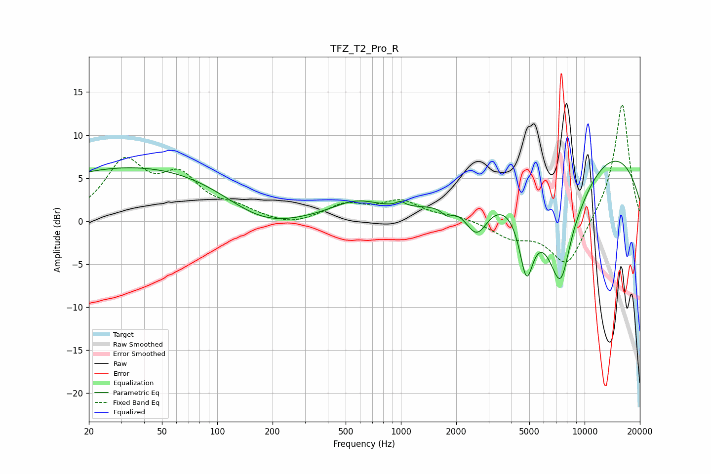

# TFZ_T2_Pro_R
See [usage instructions](https://github.com/jaakkopasanen/AutoEq#usage) for more options and info.

### Parametric EQs
Apply preamp of -7.1 dB when using parametric equalizer.

|   # | Type    |   Fc (Hz) |    Q |   Gain (dB) |
|-----|---------|-----------|------|-------------|
|   1 | Peaking |        43 | 0.21 |         6.6 |
|   2 | Peaking |       172 | 0.63 |        -3.7 |
|   3 | Peaking |       570 | 1.04 |         1.9 |
|   4 | Peaking |       996 | 5.8  |         0.6 |
|   5 | Peaking |      1776 | 4.89 |        -0.9 |
|   6 | Peaking |      2586 | 2.23 |        -4.3 |
|   7 | Peaking |      4822 | 3.45 |        -7.8 |
|   8 | Peaking |      7463 | 1.25 |       -18.3 |
|   9 | Peaking |      8108 | 2.19 |         2   |
|  10 | Peaking |      9657 | 0.25 |        11.2 |

### Fixed Band EQs
When using fixed band (also called graphic) equalizer, apply preamp of **-13.6 dB** (if available) and set gains manually with these parameters.

|   # | Type    |   Fc (Hz) |    Q |   Gain (dB) |
|-----|---------|-----------|------|-------------|
|   1 | Peaking |        31 | 1.41 |         6.5 |
|   2 | Peaking |        62 | 1.41 |         4.5 |
|   3 | Peaking |       125 | 1.41 |         1.2 |
|   4 | Peaking |       250 | 1.41 |        -0.7 |
|   5 | Peaking |       500 | 1.41 |         1.8 |
|   6 | Peaking |      1000 | 1.41 |         2.1 |
|   7 | Peaking |      2000 | 1.41 |         0.5 |
|   8 | Peaking |      4000 | 1.41 |        -1.7 |
|   9 | Peaking |      8000 | 1.41 |        -5.5 |
|  10 | Peaking |     16000 | 1.41 |        13.9 |

### Graphs

