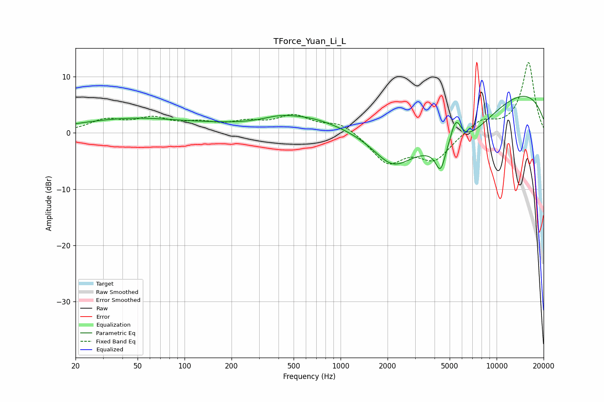

# TForce_Yuan_Li_L
See [usage instructions](https://github.com/jaakkopasanen/AutoEq#usage) for more options and info.

### Parametric EQs
Apply preamp of -6.6 dB when using parametric equalizer.

|   # | Type    |   Fc (Hz) |    Q |   Gain (dB) |
|-----|---------|-----------|------|-------------|
|   1 | Peaking |        47 | 0.39 |         2.5 |
|   2 | Peaking |       164 | 0.78 |         0.4 |
|   3 | Peaking |       398 | 1.46 |         0.6 |
|   4 | Peaking |       587 | 0.59 |         2.8 |
|   5 | Peaking |      2152 | 1.14 |        -5.4 |
|   6 | Peaking |      4343 | 4.64 |        -3.7 |
|   7 | Peaking |      4493 | 6    |        -0.6 |
|   8 | Peaking |      5475 | 3.88 |         4.8 |
|   9 | Peaking |      5582 | 0.49 |       -10.7 |
|  10 | Peaking |      9990 | 0.24 |        10.5 |

### Fixed Band EQs
When using fixed band (also called graphic) equalizer, apply preamp of **-12.6 dB** (if available) and set gains manually with these parameters.

|   # | Type    |   Fc (Hz) |    Q |   Gain (dB) |
|-----|---------|-----------|------|-------------|
|   1 | Peaking |        31 | 1.41 |         2.1 |
|   2 | Peaking |        62 | 1.41 |         2.2 |
|   3 | Peaking |       125 | 1.41 |         1.4 |
|   4 | Peaking |       250 | 1.41 |         1.5 |
|   5 | Peaking |       500 | 1.41 |         2.8 |
|   6 | Peaking |      1000 | 1.41 |         1.9 |
|   7 | Peaking |      2000 | 1.41 |        -5.2 |
|   8 | Peaking |      4000 | 1.41 |        -4.6 |
|   9 | Peaking |      8000 | 1.41 |         2.3 |
|  10 | Peaking |     16000 | 1.41 |        12.5 |

### Graphs

