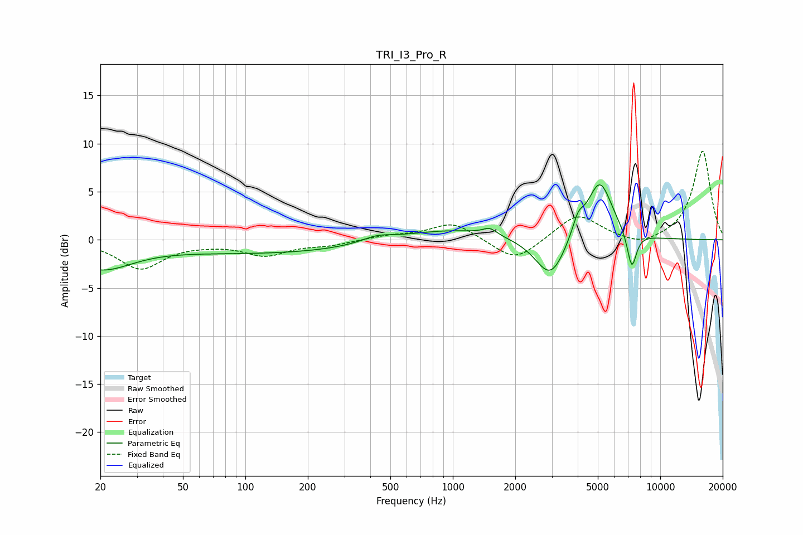

# TRI_I3_Pro_R
See [usage instructions](https://github.com/jaakkopasanen/AutoEq#usage) for more options and info.

### Parametric EQs
Apply preamp of -5.8 dB when using parametric equalizer.

|   # | Type    |   Fc (Hz) |    Q |   Gain (dB) |
|-----|---------|-----------|------|-------------|
|   1 | Peaking |        20 | 0.92 |        -2.8 |
|   2 | Peaking |       134 | 0.27 |        -1.4 |
|   3 | Peaking |       430 | 1.93 |         0.6 |
|   4 | Peaking |       927 | 0.54 |         1.2 |
|   5 | Peaking |      1509 | 4.11 |         0.7 |
|   6 | Peaking |      2962 | 1.9  |        -4.4 |
|   7 | Peaking |      3873 | 5.7  |        -1   |
|   8 | Peaking |      3957 | 4.74 |         2.8 |
|   9 | Peaking |      5108 | 2.25 |         6.2 |
|  10 | Peaking |      7292 | 5.94 |        -3.8 |

### Fixed Band EQs
When using fixed band (also called graphic) equalizer, apply preamp of **-9.3 dB** (if available) and set gains manually with these parameters.

|   # | Type    |   Fc (Hz) |    Q |   Gain (dB) |
|-----|---------|-----------|------|-------------|
|   1 | Peaking |        31 | 1.41 |        -3   |
|   2 | Peaking |        62 | 1.41 |        -0.2 |
|   3 | Peaking |       125 | 1.41 |        -1.5 |
|   4 | Peaking |       250 | 1.41 |        -0.5 |
|   5 | Peaking |       500 | 1.41 |         0.4 |
|   6 | Peaking |      1000 | 1.41 |         1.8 |
|   7 | Peaking |      2000 | 1.41 |        -2.4 |
|   8 | Peaking |      4000 | 1.41 |         2.7 |
|   9 | Peaking |      8000 | 1.41 |        -0.8 |
|  10 | Peaking |     16000 | 1.41 |         9.3 |

### Graphs

