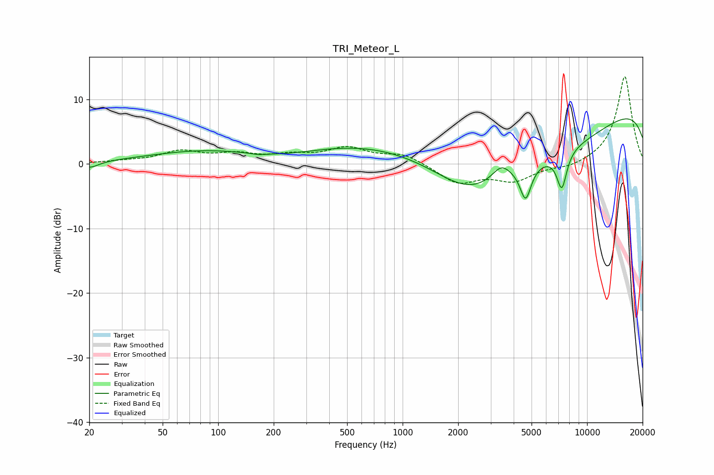

# TRI_Meteor_L
See [usage instructions](https://github.com/jaakkopasanen/AutoEq#usage) for more options and info.

### Parametric EQs
Apply preamp of -7.1 dB when using parametric equalizer.

|   # | Type    |   Fc (Hz) |    Q |   Gain (dB) |
|-----|---------|-----------|------|-------------|
|   1 | Peaking |        20 | 2.98 |        -1   |
|   2 | Peaking |       165 | 4.45 |        -0.2 |
|   3 | Peaking |       207 | 0.54 |        -2.6 |
|   4 | Peaking |       260 | 0.2  |         4.3 |
|   5 | Peaking |      2335 | 0.65 |        -6.7 |
|   6 | Peaking |      3421 | 2.93 |         2.1 |
|   7 | Peaking |      4643 | 4.57 |        -5.3 |
|   8 | Peaking |      7089 | 0.33 |        -9   |
|   9 | Peaking |      7294 | 4.87 |        -5.7 |
|  10 | Peaking |     10000 | 0.18 |        12.8 |

### Fixed Band EQs
When using fixed band (also called graphic) equalizer, apply preamp of **-13.6 dB** (if available) and set gains manually with these parameters.

|   # | Type    |   Fc (Hz) |    Q |   Gain (dB) |
|-----|---------|-----------|------|-------------|
|   1 | Peaking |        31 | 1.41 |         0.3 |
|   2 | Peaking |        62 | 1.41 |         1.8 |
|   3 | Peaking |       125 | 1.41 |         1.3 |
|   4 | Peaking |       250 | 1.41 |         1.1 |
|   5 | Peaking |       500 | 1.41 |         2.3 |
|   6 | Peaking |      1000 | 1.41 |         1.5 |
|   7 | Peaking |      2000 | 1.41 |        -2.9 |
|   8 | Peaking |      4000 | 1.41 |        -2.5 |
|   9 | Peaking |      8000 | 1.41 |        -0.7 |
|  10 | Peaking |     16000 | 1.41 |        13.7 |

### Graphs

