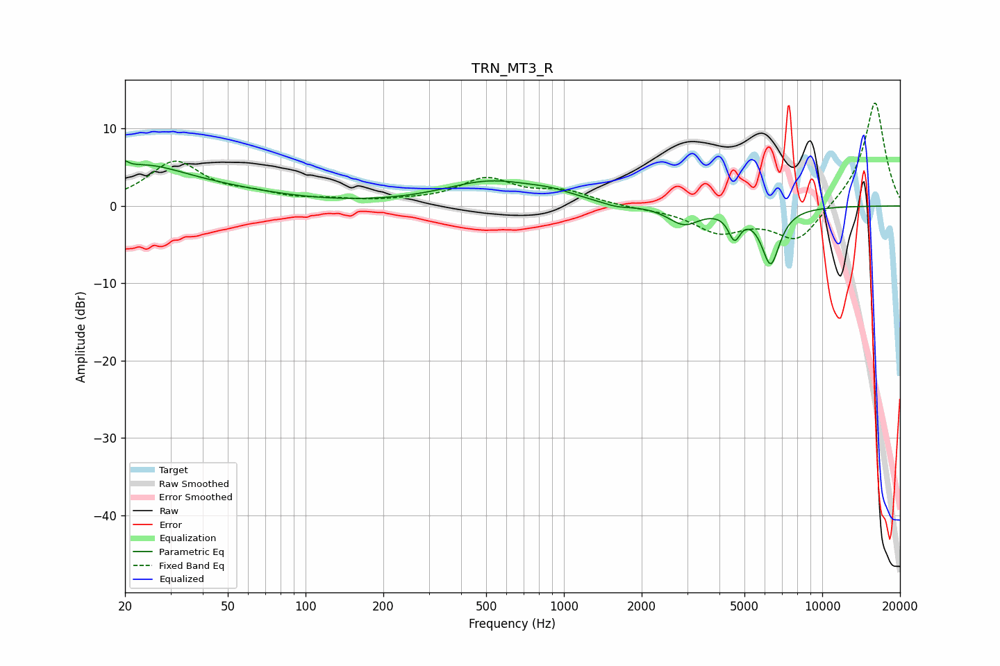

# TRN_MT3_R
See [usage instructions](https://github.com/jaakkopasanen/AutoEq#usage) for more options and info.

### Parametric EQs
Apply preamp of -5.9 dB when using parametric equalizer.

|   # | Type    |   Fc (Hz) |    Q |   Gain (dB) |
|-----|---------|-----------|------|-------------|
|   1 | Peaking |        20 | 6    |         5.1 |
|   2 | Peaking |        20 | 5.97 |        -4   |
|   3 | Peaking |        23 | 0.83 |         4.3 |
|   4 | Peaking |        47 | 0.58 |         1.4 |
|   5 | Peaking |       523 | 0.77 |         3   |
|   6 | Peaking |       900 | 1.6  |         0.7 |
|   7 | Peaking |      1595 | 2.61 |        -0.5 |
|   8 | Peaking |      2912 | 2.3  |        -2.3 |
|   9 | Peaking |      4571 | 6    |        -3.3 |
|  10 | Peaking |      6315 | 3.8  |        -7.2 |

### Fixed Band EQs
When using fixed band (also called graphic) equalizer, apply preamp of **-13.4 dB** (if available) and set gains manually with these parameters.

|   # | Type    |   Fc (Hz) |    Q |   Gain (dB) |
|-----|---------|-----------|------|-------------|
|   1 | Peaking |        31 | 1.41 |         5.6 |
|   2 | Peaking |        62 | 1.41 |         1.1 |
|   3 | Peaking |       125 | 1.41 |         0.6 |
|   4 | Peaking |       250 | 1.41 |         0.4 |
|   5 | Peaking |       500 | 1.41 |         3.3 |
|   6 | Peaking |      1000 | 1.41 |         1.7 |
|   7 | Peaking |      2000 | 1.41 |        -0.2 |
|   8 | Peaking |      4000 | 1.41 |        -3.2 |
|   9 | Peaking |      8000 | 1.41 |        -4.6 |
|  10 | Peaking |     16000 | 1.41 |        13.7 |

### Graphs

