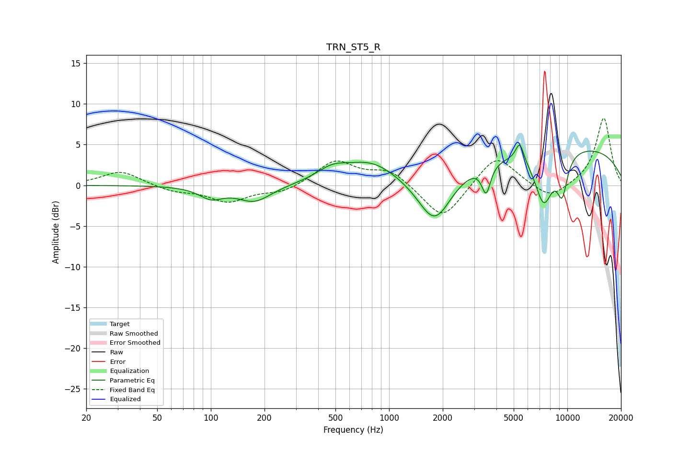

# TRN_ST5_R
See [usage instructions](https://github.com/jaakkopasanen/AutoEq#usage) for more options and info.

### Parametric EQs
Apply preamp of -5.0 dB when using parametric equalizer.

|   # | Type    |   Fc (Hz) |    Q |   Gain (dB) |
|-----|---------|-----------|------|-------------|
|   1 | Peaking |       100 | 2.15 |        -1.4 |
|   2 | Peaking |       176 | 1.5  |        -2   |
|   3 | Peaking |       479 | 1.58 |         1.5 |
|   4 | Peaking |       792 | 1    |         2.6 |
|   5 | Peaking |      1804 | 1.47 |        -6.4 |
|   6 | Peaking |      3504 | 5.81 |        -3.5 |
|   7 | Peaking |      5408 | 5.93 |         2.4 |
|   8 | Peaking |      7374 | 2.53 |        -6.4 |
|   9 | Peaking |      9109 | 0.21 |         5   |
|  10 | Peaking |      9357 | 4.17 |        -4.6 |

### Fixed Band EQs
When using fixed band (also called graphic) equalizer, apply preamp of **-8.3 dB** (if available) and set gains manually with these parameters.

|   # | Type    |   Fc (Hz) |    Q |   Gain (dB) |
|-----|---------|-----------|------|-------------|
|   1 | Peaking |        31 | 1.41 |         1.8 |
|   2 | Peaking |        62 | 1.41 |        -0.7 |
|   3 | Peaking |       125 | 1.41 |        -2   |
|   4 | Peaking |       250 | 1.41 |        -0.9 |
|   5 | Peaking |       500 | 1.41 |         3   |
|   6 | Peaking |      1000 | 1.41 |         1.9 |
|   7 | Peaking |      2000 | 1.41 |        -4.5 |
|   8 | Peaking |      4000 | 1.41 |         3.9 |
|   9 | Peaking |      8000 | 1.41 |        -1.9 |
|  10 | Peaking |     16000 | 1.41 |         8.4 |

### Graphs

