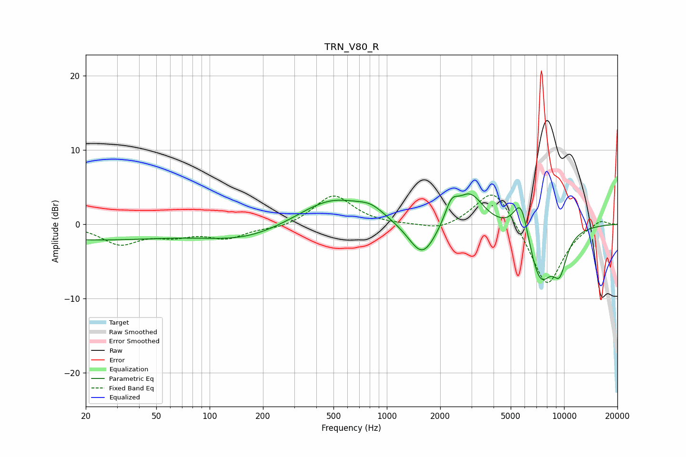

# TRN_V80_R
See [usage instructions](https://github.com/jaakkopasanen/AutoEq#usage) for more options and info.

### Parametric EQs
Apply preamp of -4.2 dB when using parametric equalizer.

|   # | Type    |   Fc (Hz) |    Q |   Gain (dB) |
|-----|---------|-----------|------|-------------|
|   1 | Peaking |        20 | 0.27 |        -2   |
|   2 | Peaking |       159 | 0.6  |        -1.9 |
|   3 | Peaking |       491 | 0.75 |         3.6 |
|   4 | Peaking |       815 | 1.91 |         1.2 |
|   5 | Peaking |      1589 | 1.79 |        -5   |
|   6 | Peaking |      2315 | 3.88 |         2.6 |
|   7 | Peaking |      2945 | 1.85 |         4.4 |
|   8 | Peaking |      5729 | 3.09 |         5.7 |
|   9 | Peaking |      7301 | 1.78 |        -8   |
|  10 | Peaking |      9456 | 3.15 |        -4.3 |

### Fixed Band EQs
When using fixed band (also called graphic) equalizer, apply preamp of **-4.0 dB** (if available) and set gains manually with these parameters.

|   # | Type    |   Fc (Hz) |    Q |   Gain (dB) |
|-----|---------|-----------|------|-------------|
|   1 | Peaking |        31 | 1.41 |        -2.5 |
|   2 | Peaking |        62 | 1.41 |        -1.2 |
|   3 | Peaking |       125 | 1.41 |        -1.7 |
|   4 | Peaking |       250 | 1.41 |        -0.6 |
|   5 | Peaking |       500 | 1.41 |         4   |
|   6 | Peaking |      1000 | 1.41 |        -0.1 |
|   7 | Peaking |      2000 | 1.41 |        -0.9 |
|   8 | Peaking |      4000 | 1.41 |         5.4 |
|   9 | Peaking |      8000 | 1.41 |        -8.6 |
|  10 | Peaking |     16000 | 1.41 |         0.8 |

### Graphs

