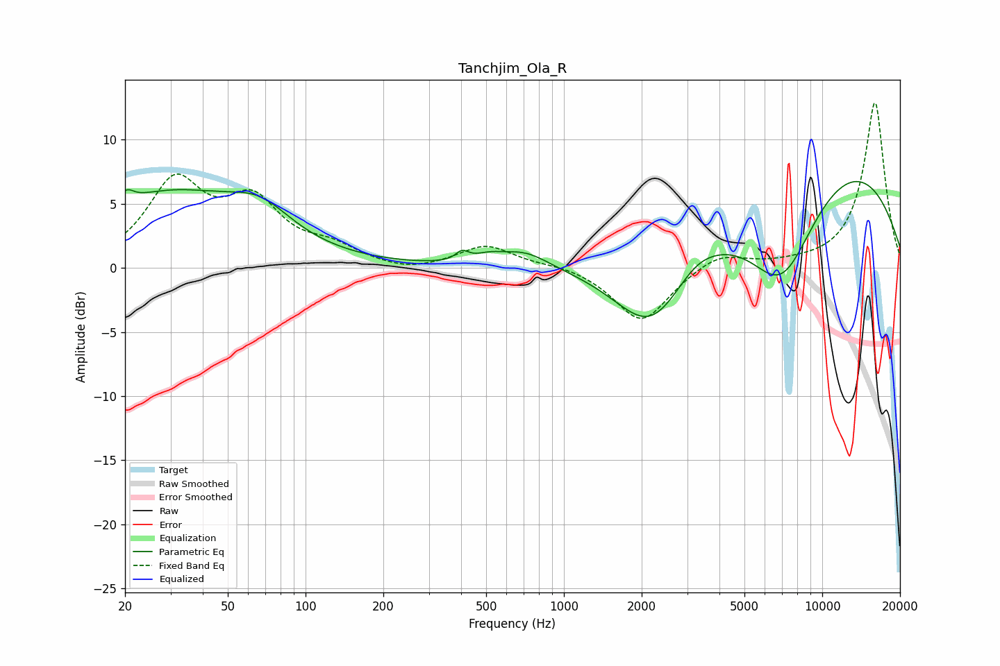

# Tanchjim_Ola_R
See [usage instructions](https://github.com/jaakkopasanen/AutoEq#usage) for more options and info.

### Parametric EQs
Apply preamp of -6.8 dB when using parametric equalizer.

|   # | Type    |   Fc (Hz) |    Q |   Gain (dB) |
|-----|---------|-----------|------|-------------|
|   1 | Peaking |        20 | 5.47 |         0.9 |
|   2 | Peaking |        29 | 0.45 |         5.6 |
|   3 | Peaking |        67 | 1.18 |         2.2 |
|   4 | Peaking |       404 | 5.8  |         0.7 |
|   5 | Peaking |       513 | 2.48 |         0.5 |
|   6 | Peaking |       705 | 1.48 |         1.3 |
|   7 | Peaking |      2191 | 0.89 |        -7.4 |
|   8 | Peaking |      3235 | 1.78 |         0.9 |
|   9 | Peaking |      6960 | 0.85 |       -10.4 |
|  10 | Peaking |      8710 | 0.27 |        11.1 |

### Fixed Band EQs
When using fixed band (also called graphic) equalizer, apply preamp of **-13.0 dB** (if available) and set gains manually with these parameters.

|   # | Type    |   Fc (Hz) |    Q |   Gain (dB) |
|-----|---------|-----------|------|-------------|
|   1 | Peaking |        31 | 1.41 |         6.4 |
|   2 | Peaking |        62 | 1.41 |         4.6 |
|   3 | Peaking |       125 | 1.41 |         1.3 |
|   4 | Peaking |       250 | 1.41 |        -0.5 |
|   5 | Peaking |       500 | 1.41 |         1.8 |
|   6 | Peaking |      1000 | 1.41 |         0.3 |
|   7 | Peaking |      2000 | 1.41 |        -4.3 |
|   8 | Peaking |      4000 | 1.41 |         1.2 |
|   9 | Peaking |      8000 | 1.41 |         0.2 |
|  10 | Peaking |     16000 | 1.41 |        13   |

### Graphs

