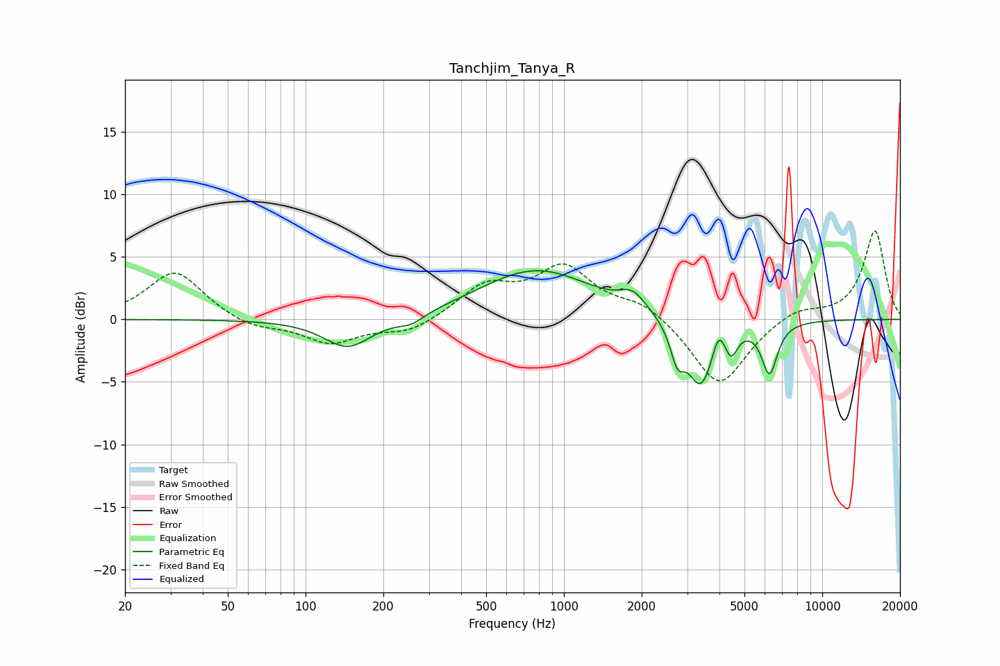

# Tanchjim_Tanya_R
See [usage instructions](https://github.com/jaakkopasanen/AutoEq#usage) for more options and info.

### Parametric EQs
Apply preamp of -4.0 dB when using parametric equalizer.

|   # | Type    |   Fc (Hz) |    Q |   Gain (dB) |
|-----|---------|-----------|------|-------------|
|   1 | Peaking |       146 | 1.5  |        -2.4 |
|   2 | Peaking |       256 | 2.69 |        -0.7 |
|   3 | Peaking |       591 | 0.95 |         0.3 |
|   4 | Peaking |       804 | 0.66 |         3.8 |
|   5 | Peaking |      1848 | 2.91 |         1.3 |
|   6 | Peaking |      2749 | 5.3  |        -2.5 |
|   7 | Peaking |      3391 | 2.63 |        -5.4 |
|   8 | Peaking |      3966 | 6    |         1.9 |
|   9 | Peaking |      4447 | 6    |        -1.8 |
|  10 | Peaking |      6248 | 4.51 |        -4.1 |

### Fixed Band EQs
When using fixed band (also called graphic) equalizer, apply preamp of **-7.2 dB** (if available) and set gains manually with these parameters.

|   # | Type    |   Fc (Hz) |    Q |   Gain (dB) |
|-----|---------|-----------|------|-------------|
|   1 | Peaking |        31 | 1.41 |         3.9 |
|   2 | Peaking |        62 | 1.41 |        -0.8 |
|   3 | Peaking |       125 | 1.41 |        -1.9 |
|   4 | Peaking |       250 | 1.41 |        -1.1 |
|   5 | Peaking |       500 | 1.41 |         2.5 |
|   6 | Peaking |      1000 | 1.41 |         4   |
|   7 | Peaking |      2000 | 1.41 |         1.3 |
|   8 | Peaking |      4000 | 1.41 |        -5.5 |
|   9 | Peaking |      8000 | 1.41 |         1   |
|  10 | Peaking |     16000 | 1.41 |         7.1 |

### Graphs

