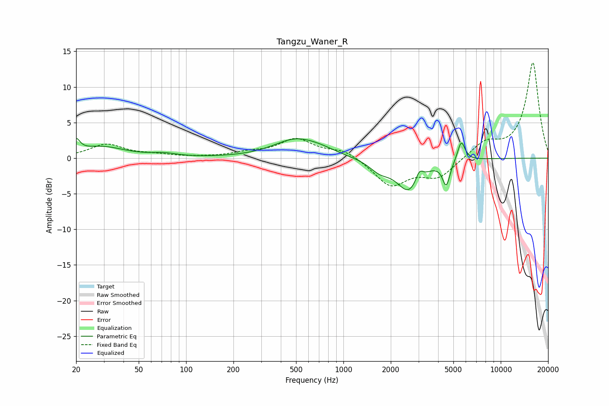

# Tangzu_Waner_R
See [usage instructions](https://github.com/jaakkopasanen/AutoEq#usage) for more options and info.

### Parametric EQs
Apply preamp of -2.9 dB when using parametric equalizer.

|   # | Type    |   Fc (Hz) |    Q |   Gain (dB) |
|-----|---------|-----------|------|-------------|
|   1 | Peaking |        20 | 5.99 |         1.7 |
|   2 | Peaking |        29 | 0.97 |         1.6 |
|   3 | Peaking |        72 | 1.79 |         0.4 |
|   4 | Peaking |       499 | 0.99 |         2.6 |
|   5 | Peaking |       721 | 1.44 |         0.5 |
|   6 | Peaking |      1698 | 2.15 |        -1.4 |
|   7 | Peaking |      2610 | 1.84 |        -4.5 |
|   8 | Peaking |      3036 | 6    |         1.6 |
|   9 | Peaking |      4505 | 6    |        -3.4 |
|  10 | Peaking |      5613 | 5.91 |         2.9 |

### Fixed Band EQs
When using fixed band (also called graphic) equalizer, apply preamp of **-13.5 dB** (if available) and set gains manually with these parameters.

|   # | Type    |   Fc (Hz) |    Q |   Gain (dB) |
|-----|---------|-----------|------|-------------|
|   1 | Peaking |        31 | 1.41 |         1.9 |
|   2 | Peaking |        62 | 1.41 |         0.4 |
|   3 | Peaking |       125 | 1.41 |         0.1 |
|   4 | Peaking |       250 | 1.41 |         0.6 |
|   5 | Peaking |       500 | 1.41 |         2.6 |
|   6 | Peaking |      1000 | 1.41 |         1.2 |
|   7 | Peaking |      2000 | 1.41 |        -3.8 |
|   8 | Peaking |      4000 | 1.41 |        -2.6 |
|   9 | Peaking |      8000 | 1.41 |         2.1 |
|  10 | Peaking |     16000 | 1.41 |        13.4 |

### Graphs

