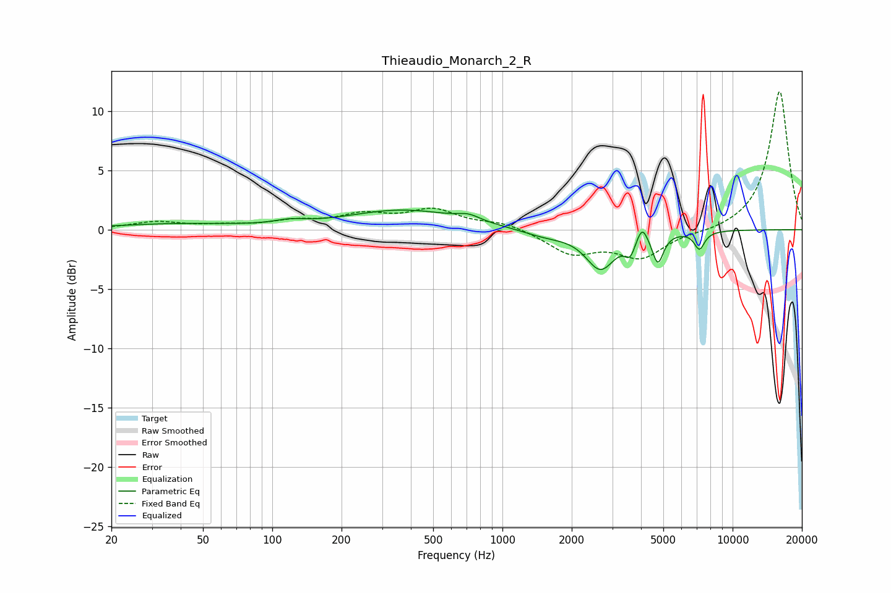

# Thieaudio_Monarch_2_R
See [usage instructions](https://github.com/jaakkopasanen/AutoEq#usage) for more options and info.

### Parametric EQs
Apply preamp of -1.7 dB when using parametric equalizer.

|   # | Type    |   Fc (Hz) |    Q |   Gain (dB) |
|-----|---------|-----------|------|-------------|
|   1 | Peaking |        38 | 0.51 |         0.5 |
|   2 | Peaking |       119 | 2.18 |         0.3 |
|   3 | Peaking |       372 | 0.59 |         1.6 |
|   4 | Peaking |       713 | 2.89 |         0.5 |
|   5 | Peaking |      1538 | 1.35 |        -0.6 |
|   6 | Peaking |      2666 | 2.22 |        -3.2 |
|   7 | Peaking |      3589 | 6    |        -1.4 |
|   8 | Peaking |      4041 | 6    |         1.4 |
|   9 | Peaking |      4734 | 5.83 |        -2.5 |
|  10 | Peaking |      7177 | 6    |        -1.5 |

### Fixed Band EQs
When using fixed band (also called graphic) equalizer, apply preamp of **-11.7 dB** (if available) and set gains manually with these parameters.

|   # | Type    |   Fc (Hz) |    Q |   Gain (dB) |
|-----|---------|-----------|------|-------------|
|   1 | Peaking |        31 | 1.41 |         0.6 |
|   2 | Peaking |        62 | 1.41 |         0.3 |
|   3 | Peaking |       125 | 1.41 |         0.6 |
|   4 | Peaking |       250 | 1.41 |         1.1 |
|   5 | Peaking |       500 | 1.41 |         1.6 |
|   6 | Peaking |      1000 | 1.41 |         0.6 |
|   7 | Peaking |      2000 | 1.41 |        -1.9 |
|   8 | Peaking |      4000 | 1.41 |        -2.3 |
|   9 | Peaking |      8000 | 1.41 |        -0.2 |
|  10 | Peaking |     16000 | 1.41 |        11.8 |

### Graphs

