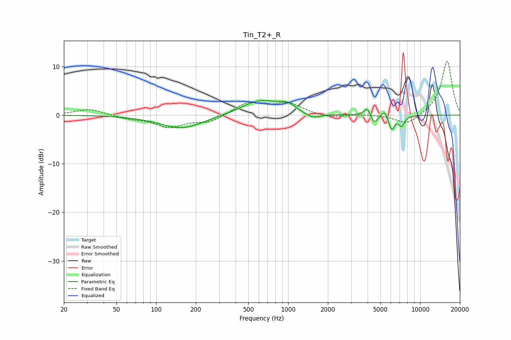

# Tin_T2+_R
See [usage instructions](https://github.com/jaakkopasanen/AutoEq#usage) for more options and info.

### Parametric EQs
Apply preamp of -3.1 dB when using parametric equalizer.

|   # | Type    |   Fc (Hz) |    Q |   Gain (dB) |
|-----|---------|-----------|------|-------------|
|   1 | Peaking |       157 | 0.85 |        -2.8 |
|   2 | Peaking |       618 | 0.98 |         3.1 |
|   3 | Peaking |       979 | 2.47 |         1.1 |
|   4 | Peaking |      1024 | 2.14 |         0.3 |
|   5 | Peaking |      1535 | 2.45 |        -1.1 |
|   6 | Peaking |      3969 | 6    |         1.6 |
|   7 | Peaking |      4491 | 6    |        -1.8 |
|   8 | Peaking |      5398 | 6    |         1.5 |
|   9 | Peaking |      6074 | 6    |        -3   |
|  10 | Peaking |      7228 | 6    |        -2   |

### Fixed Band EQs
When using fixed band (also called graphic) equalizer, apply preamp of **-11.2 dB** (if available) and set gains manually with these parameters.

|   # | Type    |   Fc (Hz) |    Q |   Gain (dB) |
|-----|---------|-----------|------|-------------|
|   1 | Peaking |        31 | 1.41 |         1.3 |
|   2 | Peaking |        62 | 1.41 |        -0.6 |
|   3 | Peaking |       125 | 1.41 |        -2.4 |
|   4 | Peaking |       250 | 1.41 |        -1.4 |
|   5 | Peaking |       500 | 1.41 |         2.5 |
|   6 | Peaking |      1000 | 1.41 |         2.3 |
|   7 | Peaking |      2000 | 1.41 |        -0.6 |
|   8 | Peaking |      4000 | 1.41 |         0.2 |
|   9 | Peaking |      8000 | 1.41 |        -2.1 |
|  10 | Peaking |     16000 | 1.41 |        11.3 |

### Graphs

