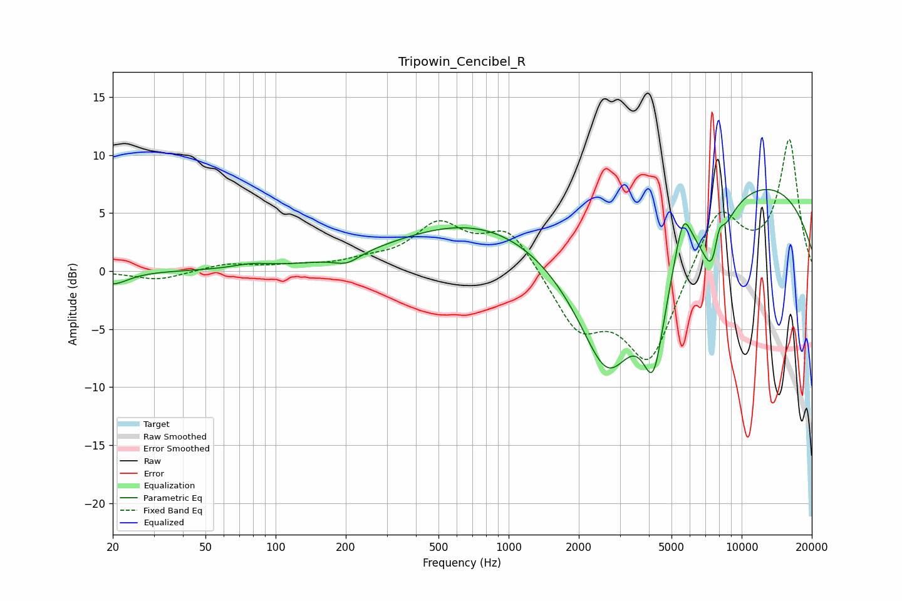

# Tripowin_Cencibel_R
See [usage instructions](https://github.com/jaakkopasanen/AutoEq#usage) for more options and info.

### Parametric EQs
Apply preamp of -7.1 dB when using parametric equalizer.

|   # | Type    |   Fc (Hz) |    Q |   Gain (dB) |
|-----|---------|-----------|------|-------------|
|   1 | Peaking |        20 | 2.14 |        -1.1 |
|   2 | Peaking |        79 | 1.77 |         0.4 |
|   3 | Peaking |       202 | 2.57 |        -0.8 |
|   4 | Peaking |       899 | 0.35 |         5.2 |
|   5 | Peaking |      2666 | 0.79 |       -16.1 |
|   6 | Peaking |      4188 | 2.85 |        -8.2 |
|   7 | Peaking |      5611 | 4.05 |         3.9 |
|   8 | Peaking |      7616 | 2.77 |        -6.5 |
|   9 | Peaking |      7972 | 5.65 |         3.3 |
|  10 | Peaking |      8359 | 0.2  |         8.9 |

### Fixed Band EQs
When using fixed band (also called graphic) equalizer, apply preamp of **-11.4 dB** (if available) and set gains manually with these parameters.

|   # | Type    |   Fc (Hz) |    Q |   Gain (dB) |
|-----|---------|-----------|------|-------------|
|   1 | Peaking |        31 | 1.41 |        -0.8 |
|   2 | Peaking |        62 | 1.41 |         0.6 |
|   3 | Peaking |       125 | 1.41 |         0.4 |
|   4 | Peaking |       250 | 1.41 |         0.7 |
|   5 | Peaking |       500 | 1.41 |         3.8 |
|   6 | Peaking |      1000 | 1.41 |         3.7 |
|   7 | Peaking |      2000 | 1.41 |        -4.8 |
|   8 | Peaking |      4000 | 1.41 |        -7.8 |
|   9 | Peaking |      8000 | 1.41 |         5.6 |
|  10 | Peaking |     16000 | 1.41 |        11.2 |

### Graphs

