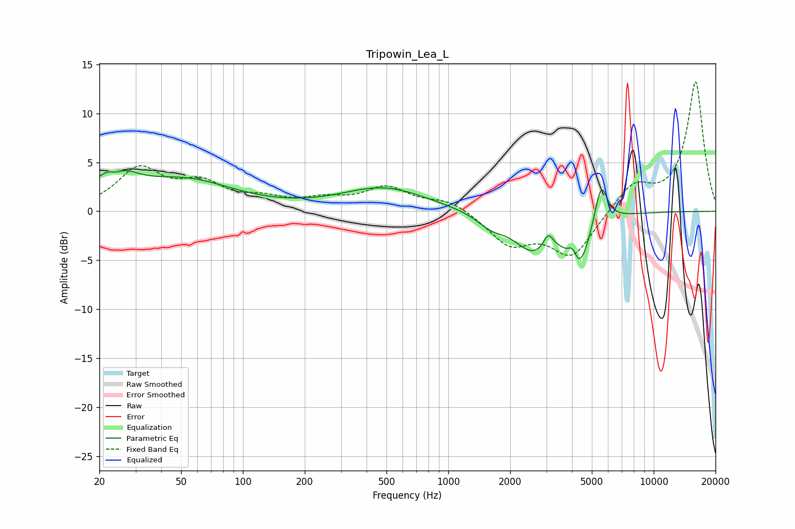

# Tripowin_Lea_L
See [usage instructions](https://github.com/jaakkopasanen/AutoEq#usage) for more options and info.

### Parametric EQs
Apply preamp of -4.2 dB when using parametric equalizer.

|   # | Type    |   Fc (Hz) |    Q |   Gain (dB) |
|-----|---------|-----------|------|-------------|
|   1 | Peaking |        24 | 1.68 |         4   |
|   2 | Peaking |        24 | 3.38 |        -1.4 |
|   3 | Peaking |        52 | 0.6  |         3   |
|   4 | Peaking |       486 | 0.69 |         2.4 |
|   5 | Peaking |      1613 | 2.09 |        -1.2 |
|   6 | Peaking |      2595 | 1.46 |        -3.7 |
|   7 | Peaking |      3064 | 6    |         1.5 |
|   8 | Peaking |      4040 | 6    |         2   |
|   9 | Peaking |      4277 | 2.59 |        -5.7 |
|  10 | Peaking |      5545 | 4.5  |         4.3 |

### Fixed Band EQs
When using fixed band (also called graphic) equalizer, apply preamp of **-13.3 dB** (if available) and set gains manually with these parameters.

|   # | Type    |   Fc (Hz) |    Q |   Gain (dB) |
|-----|---------|-----------|------|-------------|
|   1 | Peaking |        31 | 1.41 |         4.1 |
|   2 | Peaking |        62 | 1.41 |         2.5 |
|   3 | Peaking |       125 | 1.41 |         1   |
|   4 | Peaking |       250 | 1.41 |         1   |
|   5 | Peaking |       500 | 1.41 |         2.3 |
|   6 | Peaking |      1000 | 1.41 |         1.2 |
|   7 | Peaking |      2000 | 1.41 |        -3.2 |
|   8 | Peaking |      4000 | 1.41 |        -4.5 |
|   9 | Peaking |      8000 | 1.41 |         2.7 |
|  10 | Peaking |     16000 | 1.41 |        13.2 |

### Graphs

