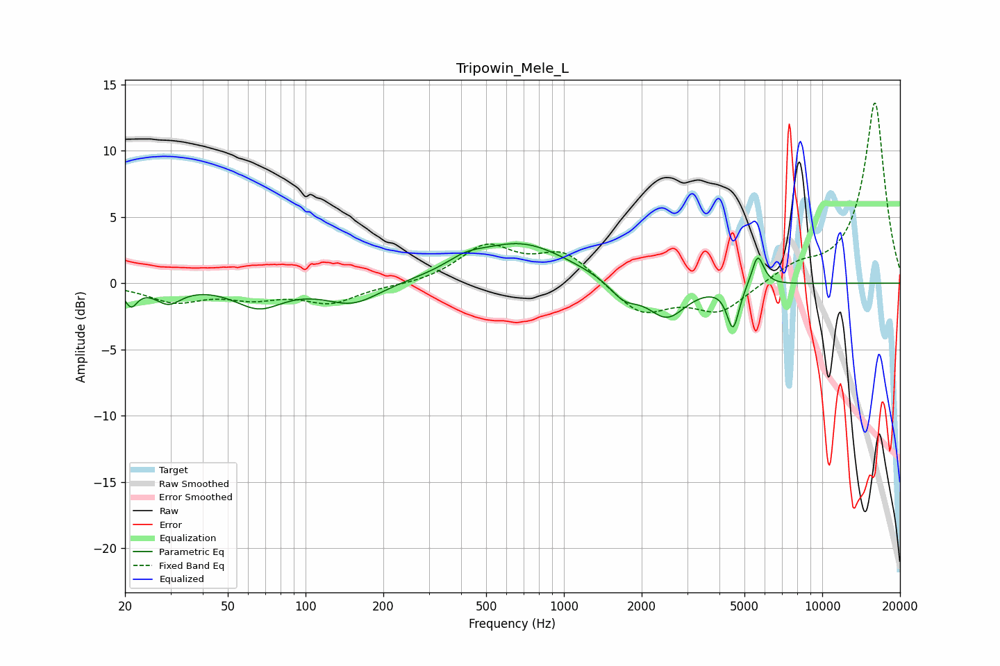

# Tripowin_Mele_L
See [usage instructions](https://github.com/jaakkopasanen/AutoEq#usage) for more options and info.

### Parametric EQs
Apply preamp of -3.1 dB when using parametric equalizer.

|   # | Type    |   Fc (Hz) |    Q |   Gain (dB) |
|-----|---------|-----------|------|-------------|
|   1 | Peaking |        21 | 5.95 |        -1.4 |
|   2 | Peaking |        29 | 2.84 |        -1.3 |
|   3 | Peaking |        66 | 1.55 |        -1.7 |
|   4 | Peaking |       152 | 1.34 |        -1.6 |
|   5 | Peaking |       415 | 1.94 |         0.7 |
|   6 | Peaking |       683 | 0.77 |         3   |
|   7 | Peaking |      1706 | 2.53 |        -1.3 |
|   8 | Peaking |      2501 | 1.87 |        -2.7 |
|   9 | Peaking |      4515 | 5.98 |        -3.3 |
|  10 | Peaking |      5627 | 5.98 |         2.4 |

### Fixed Band EQs
When using fixed band (also called graphic) equalizer, apply preamp of **-13.7 dB** (if available) and set gains manually with these parameters.

|   # | Type    |   Fc (Hz) |    Q |   Gain (dB) |
|-----|---------|-----------|------|-------------|
|   1 | Peaking |        31 | 1.41 |        -1.3 |
|   2 | Peaking |        62 | 1.41 |        -0.9 |
|   3 | Peaking |       125 | 1.41 |        -1.4 |
|   4 | Peaking |       250 | 1.41 |        -0.2 |
|   5 | Peaking |       500 | 1.41 |         2.7 |
|   6 | Peaking |      1000 | 1.41 |         2.3 |
|   7 | Peaking |      2000 | 1.41 |        -2.4 |
|   8 | Peaking |      4000 | 1.41 |        -2.2 |
|   9 | Peaking |      8000 | 1.41 |         1.1 |
|  10 | Peaking |     16000 | 1.41 |        13.7 |

### Graphs

