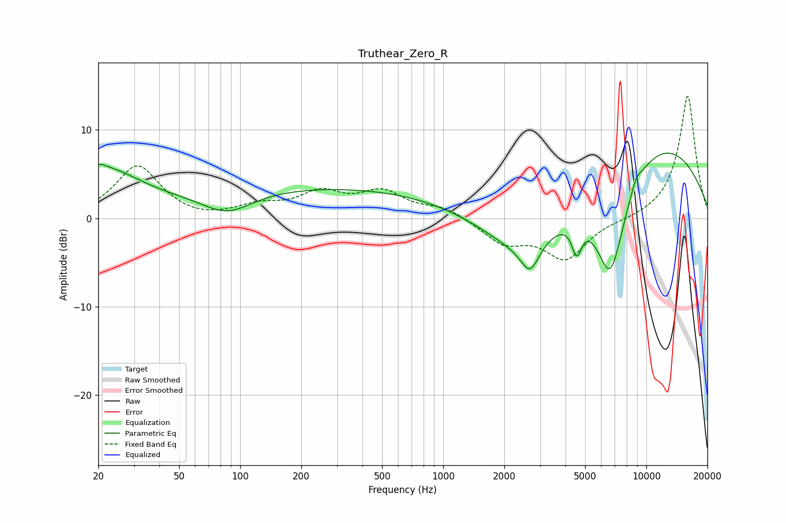

# Truthear_Zero_R
See [usage instructions](https://github.com/jaakkopasanen/AutoEq#usage) for more options and info.

### Parametric EQs
Apply preamp of -7.5 dB when using parametric equalizer.

|   # | Type    |   Fc (Hz) |    Q |   Gain (dB) |
|-----|---------|-----------|------|-------------|
|   1 | Peaking |        20 | 5.24 |         0.5 |
|   2 | Peaking |        21 | 0.77 |         5.1 |
|   3 | Peaking |        86 | 1.12 |        -2.5 |
|   4 | Peaking |       263 | 0.18 |         3.5 |
|   5 | Peaking |      2497 | 0.66 |        -6.7 |
|   6 | Peaking |      2677 | 3.07 |        -3.2 |
|   7 | Peaking |      4547 | 5.76 |        -3.5 |
|   8 | Peaking |      6659 | 1.59 |       -13.3 |
|   9 | Peaking |      8912 | 5.05 |         1   |
|  10 | Peaking |      9158 | 0.29 |        10.1 |

### Fixed Band EQs
When using fixed band (also called graphic) equalizer, apply preamp of **-13.9 dB** (if available) and set gains manually with these parameters.

|   # | Type    |   Fc (Hz) |    Q |   Gain (dB) |
|-----|---------|-----------|------|-------------|
|   1 | Peaking |        31 | 1.41 |         5.9 |
|   2 | Peaking |        62 | 1.41 |        -0.4 |
|   3 | Peaking |       125 | 1.41 |         1.2 |
|   4 | Peaking |       250 | 1.41 |         2.6 |
|   5 | Peaking |       500 | 1.41 |         2.7 |
|   6 | Peaking |      1000 | 1.41 |         1.2 |
|   7 | Peaking |      2000 | 1.41 |        -2.7 |
|   8 | Peaking |      4000 | 1.41 |        -4.5 |
|   9 | Peaking |      8000 | 1.41 |        -0.2 |
|  10 | Peaking |     16000 | 1.41 |        14   |

### Graphs

