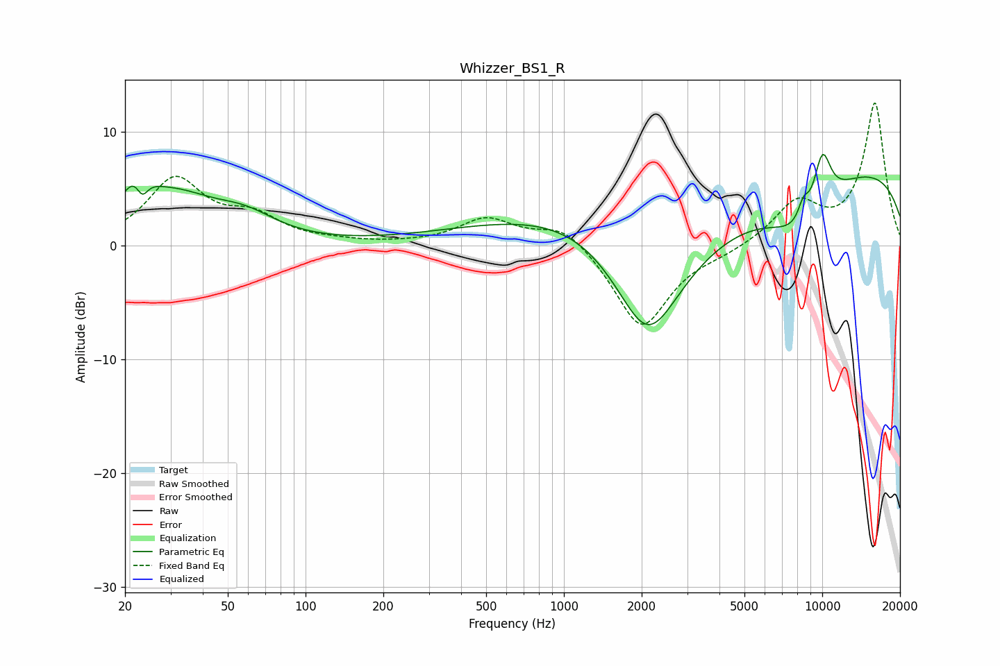

# Whizzer_BS1_R
See [usage instructions](https://github.com/jaakkopasanen/AutoEq#usage) for more options and info.

### Parametric EQs
Apply preamp of -8.1 dB when using parametric equalizer.

|   # | Type    |   Fc (Hz) |    Q |   Gain (dB) |
|-----|---------|-----------|------|-------------|
|   1 | Peaking |        22 | 2.61 |         3.5 |
|   2 | Peaking |        23 | 5.96 |        -2.1 |
|   3 | Peaking |        31 | 0.88 |         3.9 |
|   4 | Peaking |        58 | 1.16 |         1.8 |
|   5 | Peaking |      1392 | 0.38 |         9.8 |
|   6 | Peaking |      2109 | 0.61 |       -19.3 |
|   7 | Peaking |      8372 | 1.09 |        -4.3 |
|   8 | Peaking |      8452 | 5.85 |         1.7 |
|   9 | Peaking |     10000 | 0.18 |         7.6 |
|  10 | Peaking |     10000 | 3.39 |         5.1 |

### Fixed Band EQs
When using fixed band (also called graphic) equalizer, apply preamp of **-12.6 dB** (if available) and set gains manually with these parameters.

|   # | Type    |   Fc (Hz) |    Q |   Gain (dB) |
|-----|---------|-----------|------|-------------|
|   1 | Peaking |        31 | 1.41 |         5.7 |
|   2 | Peaking |        62 | 1.41 |         2.2 |
|   3 | Peaking |       125 | 1.41 |         0.2 |
|   4 | Peaking |       250 | 1.41 |         0.1 |
|   5 | Peaking |       500 | 1.41 |         2.3 |
|   6 | Peaking |      1000 | 1.41 |         2   |
|   7 | Peaking |      2000 | 1.41 |        -7.4 |
|   8 | Peaking |      4000 | 1.41 |        -0.5 |
|   9 | Peaking |      8000 | 1.41 |         3.6 |
|  10 | Peaking |     16000 | 1.41 |        12.5 |

### Graphs

