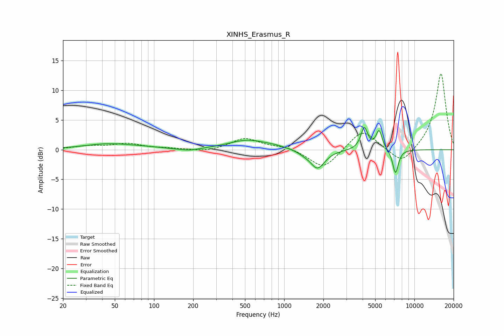

# XINHS_Erasmus_R
See [usage instructions](https://github.com/jaakkopasanen/AutoEq#usage) for more options and info.

### Parametric EQs
Apply preamp of -3.8 dB when using parametric equalizer.

|   # | Type    |   Fc (Hz) |    Q |   Gain (dB) |
|-----|---------|-----------|------|-------------|
|   1 | Peaking |        45 | 0.76 |         1   |
|   2 | Peaking |        83 | 1.27 |         0.2 |
|   3 | Peaking |       186 | 1.87 |        -0.4 |
|   4 | Peaking |       524 | 0.96 |         1.6 |
|   5 | Peaking |       852 | 1.79 |         0.3 |
|   6 | Peaking |      1402 | 3.2  |        -0.3 |
|   7 | Peaking |      1801 | 2.5  |        -3.2 |
|   8 | Peaking |      4124 | 5.34 |         3.7 |
|   9 | Peaking |      5356 | 5.87 |         3.2 |
|  10 | Peaking |      7158 | 6    |        -4.1 |

### Fixed Band EQs
When using fixed band (also called graphic) equalizer, apply preamp of **-12.9 dB** (if available) and set gains manually with these parameters.

|   # | Type    |   Fc (Hz) |    Q |   Gain (dB) |
|-----|---------|-----------|------|-------------|
|   1 | Peaking |        31 | 1.41 |         0.6 |
|   2 | Peaking |        62 | 1.41 |         1   |
|   3 | Peaking |       125 | 1.41 |         0.2 |
|   4 | Peaking |       250 | 1.41 |        -0.4 |
|   5 | Peaking |       500 | 1.41 |         1.9 |
|   6 | Peaking |      1000 | 1.41 |         0.5 |
|   7 | Peaking |      2000 | 1.41 |        -3.3 |
|   8 | Peaking |      4000 | 1.41 |         3.5 |
|   9 | Peaking |      8000 | 1.41 |        -2.7 |
|  10 | Peaking |     16000 | 1.41 |        13   |

### Graphs

