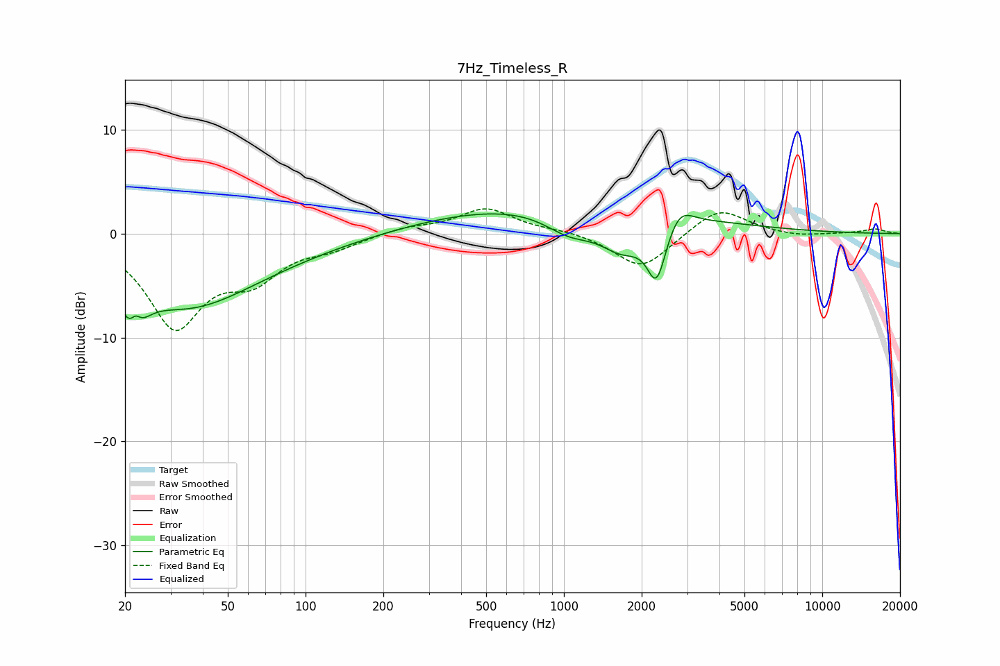

# 7Hz_Timeless_R
See [usage instructions](https://github.com/jaakkopasanen/AutoEq#usage) for more options and info.

### Parametric EQs
Apply preamp of -2.0 dB when using parametric equalizer.

|   # | Type    |   Fc (Hz) |    Q |   Gain (dB) |
|-----|---------|-----------|------|-------------|
|   1 | Peaking |        22 | 3.56 |        -5.9 |
|   2 | Peaking |        22 | 5.96 |         3.2 |
|   3 | Peaking |        34 | 0.56 |        -5.9 |
|   4 | Peaking |        62 | 0.4  |        -1.3 |
|   5 | Peaking |      1011 | 0.27 |         3   |
|   6 | Peaking |      1050 | 1.41 |        -2.2 |
|   7 | Peaking |      1681 | 1.5  |        -3.7 |
|   8 | Peaking |      1771 | 1    |         0.3 |
|   9 | Peaking |      2285 | 3.8  |        -5.4 |
|  10 | Peaking |      2799 | 2.89 |         1.9 |

### Fixed Band EQs
When using fixed band (also called graphic) equalizer, apply preamp of **-2.5 dB** (if available) and set gains manually with these parameters.

|   # | Type    |   Fc (Hz) |    Q |   Gain (dB) |
|-----|---------|-----------|------|-------------|
|   1 | Peaking |        31 | 1.41 |        -8.6 |
|   2 | Peaking |        62 | 1.41 |        -3.6 |
|   3 | Peaking |       125 | 1.41 |        -1.1 |
|   4 | Peaking |       250 | 1.41 |         0.6 |
|   5 | Peaking |       500 | 1.41 |         2.4 |
|   6 | Peaking |      1000 | 1.41 |         0.3 |
|   7 | Peaking |      2000 | 1.41 |        -3.5 |
|   8 | Peaking |      4000 | 1.41 |         2.6 |
|   9 | Peaking |      8000 | 1.41 |        -0.3 |
|  10 | Peaking |     16000 | 1.41 |         0.4 |

### Graphs

