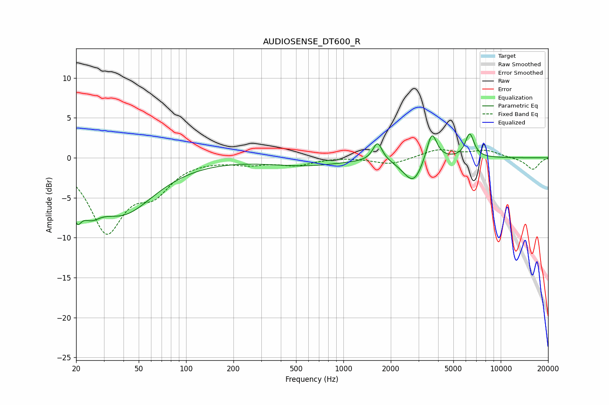

# AUDIOSENSE_DT600_R
See [usage instructions](https://github.com/jaakkopasanen/AutoEq#usage) for more options and info.

### Parametric EQs
Apply preamp of -3.1 dB when using parametric equalizer.

|   # | Type    |   Fc (Hz) |    Q |   Gain (dB) |
|-----|---------|-----------|------|-------------|
|   1 | Peaking |        20 | 5.31 |        -6.8 |
|   2 | Peaking |        20 | 5.9  |         3.2 |
|   3 | Peaking |        25 | 2.33 |        -2.5 |
|   4 | Peaking |        39 | 0.69 |        -6.7 |
|   5 | Peaking |       571 | 0.59 |        -0.9 |
|   6 | Peaking |      1647 | 4.84 |         2.4 |
|   7 | Peaking |      2539 | 2.42 |        -0.9 |
|   8 | Peaking |      2835 | 2.74 |        -2.3 |
|   9 | Peaking |      3646 | 4.42 |         3.7 |
|  10 | Peaking |      6345 | 4.99 |         3   |

### Fixed Band EQs
When using fixed band (also called graphic) equalizer, apply preamp of **-1.1 dB** (if available) and set gains manually with these parameters.

|   # | Type    |   Fc (Hz) |    Q |   Gain (dB) |
|-----|---------|-----------|------|-------------|
|   1 | Peaking |        31 | 1.41 |        -8.9 |
|   2 | Peaking |        62 | 1.41 |        -3.5 |
|   3 | Peaking |       125 | 1.41 |        -0.1 |
|   4 | Peaking |       250 | 1.41 |        -0.7 |
|   5 | Peaking |       500 | 1.41 |        -0.8 |
|   6 | Peaking |      1000 | 1.41 |         0.1 |
|   7 | Peaking |      2000 | 1.41 |        -0.9 |
|   8 | Peaking |      4000 | 1.41 |         1   |
|   9 | Peaking |      8000 | 1.41 |         0.9 |
|  10 | Peaking |     16000 | 1.41 |        -1.5 |

### Graphs

