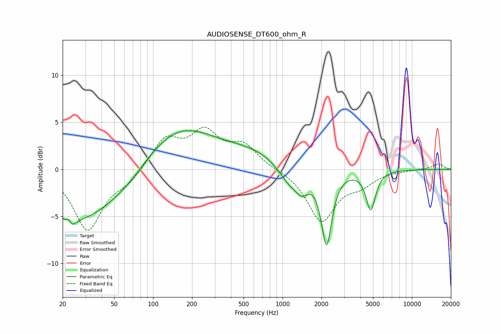

# AUDIOSENSE_DT600_ohm_R
See [usage instructions](https://github.com/jaakkopasanen/AutoEq#usage) for more options and info.

### Parametric EQs
Apply preamp of -4.2 dB when using parametric equalizer.

|   # | Type    |   Fc (Hz) |    Q |   Gain (dB) |
|-----|---------|-----------|------|-------------|
|   1 | Peaking |        22 | 5.78 |         3.2 |
|   2 | Peaking |        22 | 4.39 |        -3.8 |
|   3 | Peaking |        28 | 0.5  |        -5.3 |
|   4 | Peaking |        65 | 0.93 |        -1   |
|   5 | Peaking |       156 | 0.5  |         4.6 |
|   6 | Peaking |       615 | 0.63 |         1.5 |
|   7 | Peaking |      1157 | 1.55 |        -2.1 |
|   8 | Peaking |      1419 | 3.05 |        -1.4 |
|   9 | Peaking |      2190 | 3.54 |        -7.8 |
|  10 | Peaking |      4807 | 3.91 |        -4.1 |

### Fixed Band EQs
When using fixed band (also called graphic) equalizer, apply preamp of **-4.6 dB** (if available) and set gains manually with these parameters.

|   # | Type    |   Fc (Hz) |    Q |   Gain (dB) |
|-----|---------|-----------|------|-------------|
|   1 | Peaking |        31 | 1.41 |        -6.4 |
|   2 | Peaking |        62 | 1.41 |        -1.2 |
|   3 | Peaking |       125 | 1.41 |         3.2 |
|   4 | Peaking |       250 | 1.41 |         3.6 |
|   5 | Peaking |       500 | 1.41 |         2.3 |
|   6 | Peaking |      1000 | 1.41 |        -0   |
|   7 | Peaking |      2000 | 1.41 |        -5.4 |
|   8 | Peaking |      4000 | 1.41 |        -1.3 |
|   9 | Peaking |      8000 | 1.41 |        -0.1 |
|  10 | Peaking |     16000 | 1.41 |         0.6 |

### Graphs

