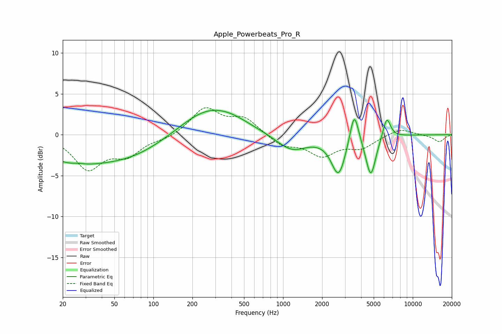

# Apple_Powerbeats_Pro_R
See [usage instructions](https://github.com/jaakkopasanen/AutoEq#usage) for more options and info.

### Parametric EQs
Apply preamp of -3.1 dB when using parametric equalizer.

|   # | Type    |   Fc (Hz) |    Q |   Gain (dB) |
|-----|---------|-----------|------|-------------|
|   1 | Peaking |        23 | 0.67 |        -2.5 |
|   2 | Peaking |        26 | 2.8  |         0.2 |
|   3 | Peaking |        62 | 0.48 |        -2.6 |
|   4 | Peaking |       261 | 0.65 |         3.3 |
|   5 | Peaking |       404 | 1.04 |         0.6 |
|   6 | Peaking |      1164 | 1.2  |        -2   |
|   7 | Peaking |      2679 | 2.58 |        -4.8 |
|   8 | Peaking |      3537 | 4.21 |         4.2 |
|   9 | Peaking |      4748 | 3.61 |        -5   |
|  10 | Peaking |      6297 | 4.68 |         2.6 |

### Fixed Band EQs
When using fixed band (also called graphic) equalizer, apply preamp of **-3.4 dB** (if available) and set gains manually with these parameters.

|   # | Type    |   Fc (Hz) |    Q |   Gain (dB) |
|-----|---------|-----------|------|-------------|
|   1 | Peaking |        31 | 1.41 |        -4   |
|   2 | Peaking |        62 | 1.41 |        -2.2 |
|   3 | Peaking |       125 | 1.41 |        -0.5 |
|   4 | Peaking |       250 | 1.41 |         3.2 |
|   5 | Peaking |       500 | 1.41 |         1.9 |
|   6 | Peaking |      1000 | 1.41 |        -1.3 |
|   7 | Peaking |      2000 | 1.41 |        -2.4 |
|   8 | Peaking |      4000 | 1.41 |        -1.5 |
|   9 | Peaking |      8000 | 1.41 |         0.8 |
|  10 | Peaking |     16000 | 1.41 |        -0.9 |

### Graphs

