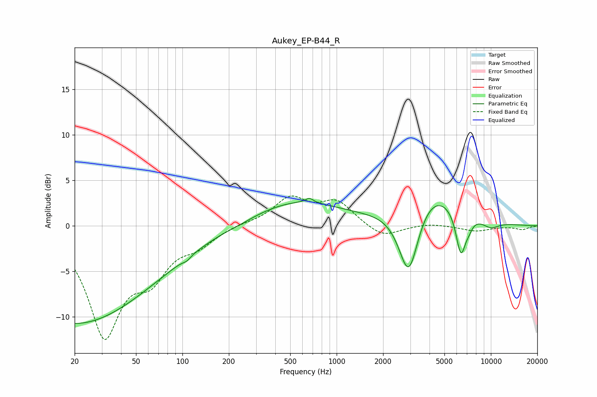

# Aukey_EP-B44_R
See [usage instructions](https://github.com/jaakkopasanen/AutoEq#usage) for more options and info.

### Parametric EQs
Apply preamp of -3.1 dB when using parametric equalizer.

|   # | Type    |   Fc (Hz) |    Q |   Gain (dB) |
|-----|---------|-----------|------|-------------|
|   1 | Peaking |        20 | 0.26 |       -10.7 |
|   2 | Peaking |       107 | 5.9  |        -0.3 |
|   3 | Peaking |       238 | 1.64 |        -0.2 |
|   4 | Peaking |       544 | 0.49 |         2.7 |
|   5 | Peaking |       666 | 5.81 |         0.5 |
|   6 | Peaking |      2936 | 2.07 |        -8.5 |
|   7 | Peaking |      3960 | 0.76 |         4.7 |
|   8 | Peaking |      6393 | 4.14 |        -4.9 |
|   9 | Peaking |      7223 | 5.79 |        -0.7 |
|  10 | Peaking |      9959 | 2.23 |        -0.8 |

### Fixed Band EQs
When using fixed band (also called graphic) equalizer, apply preamp of **-3.4 dB** (if available) and set gains manually with these parameters.

|   # | Type    |   Fc (Hz) |    Q |   Gain (dB) |
|-----|---------|-----------|------|-------------|
|   1 | Peaking |        31 | 1.41 |       -11.6 |
|   2 | Peaking |        62 | 1.41 |        -4.4 |
|   3 | Peaking |       125 | 1.41 |        -1.7 |
|   4 | Peaking |       250 | 1.41 |         0.2 |
|   5 | Peaking |       500 | 1.41 |         2.9 |
|   6 | Peaking |      1000 | 1.41 |         2.5 |
|   7 | Peaking |      2000 | 1.41 |        -1.4 |
|   8 | Peaking |      4000 | 1.41 |         0.3 |
|   9 | Peaking |      8000 | 1.41 |        -0.6 |
|  10 | Peaking |     16000 | 1.41 |        -0.4 |

### Graphs

