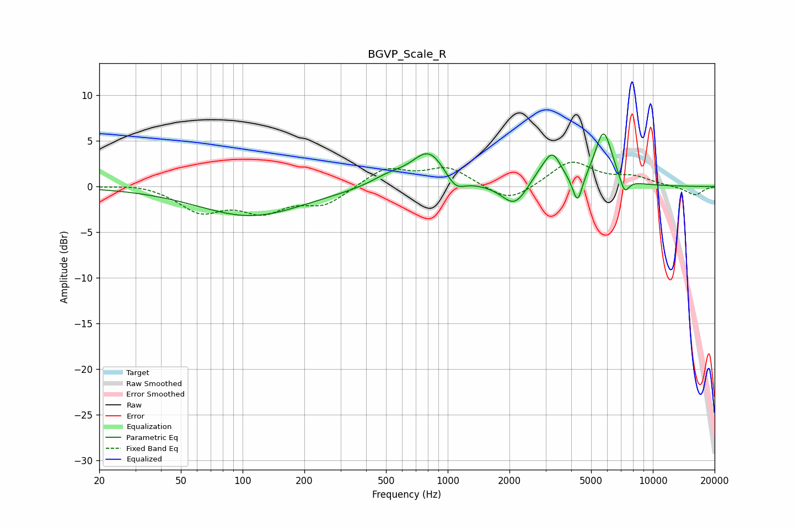

# BGVP_Scale_R
See [usage instructions](https://github.com/jaakkopasanen/AutoEq#usage) for more options and info.

### Parametric EQs
Apply preamp of -5.9 dB when using parametric equalizer.

|   # | Type    |   Fc (Hz) |    Q |   Gain (dB) |
|-----|---------|-----------|------|-------------|
|   1 | Peaking |       110 | 0.55 |        -3.2 |
|   2 | Peaking |       513 | 1.6  |         1   |
|   3 | Peaking |       810 | 1.69 |         3.9 |
|   4 | Peaking |      1087 | 3.04 |        -1.6 |
|   5 | Peaking |      2120 | 2.29 |        -2.5 |
|   6 | Peaking |      2809 | 2.39 |         1.1 |
|   7 | Peaking |      3243 | 3.32 |         3   |
|   8 | Peaking |      4291 | 5.97 |        -3.1 |
|   9 | Peaking |      5748 | 3.21 |         6   |
|  10 | Peaking |      7277 | 5.91 |        -1.8 |

### Fixed Band EQs
When using fixed band (also called graphic) equalizer, apply preamp of **-2.8 dB** (if available) and set gains manually with these parameters.

|   # | Type    |   Fc (Hz) |    Q |   Gain (dB) |
|-----|---------|-----------|------|-------------|
|   1 | Peaking |        31 | 1.41 |         0.4 |
|   2 | Peaking |        62 | 1.41 |        -2.6 |
|   3 | Peaking |       125 | 1.41 |        -2.4 |
|   4 | Peaking |       250 | 1.41 |        -1.9 |
|   5 | Peaking |       500 | 1.41 |         2   |
|   6 | Peaking |      1000 | 1.41 |         2   |
|   7 | Peaking |      2000 | 1.41 |        -1.9 |
|   8 | Peaking |      4000 | 1.41 |         2.8 |
|   9 | Peaking |      8000 | 1.41 |         0.9 |
|  10 | Peaking |     16000 | 1.41 |        -1   |

### Graphs

