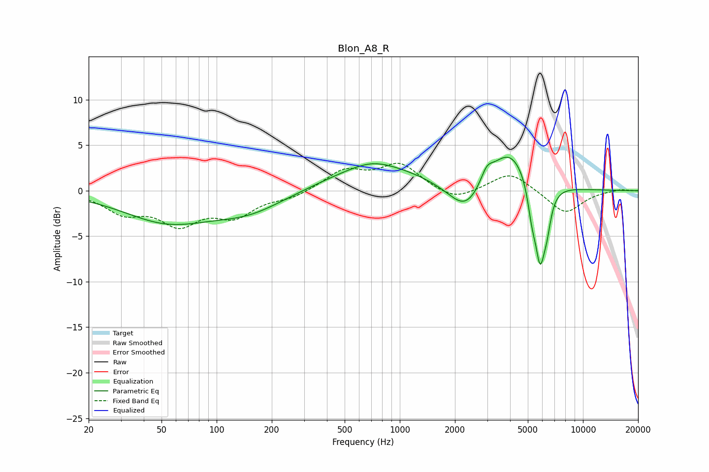

# Blon_A8_R
See [usage instructions](https://github.com/jaakkopasanen/AutoEq#usage) for more options and info.

### Parametric EQs
Apply preamp of -3.8 dB when using parametric equalizer.

|   # | Type    |   Fc (Hz) |    Q |   Gain (dB) |
|-----|---------|-----------|------|-------------|
|   1 | Peaking |        54 | 0.58 |        -3.2 |
|   2 | Peaking |       150 | 0.72 |        -2   |
|   3 | Peaking |       700 | 1.5  |         0.4 |
|   4 | Peaking |       737 | 0.57 |         2.9 |
|   5 | Peaking |      2302 | 1.48 |        -3.5 |
|   6 | Peaking |      2982 | 4.18 |         1.5 |
|   7 | Peaking |      3958 | 1.26 |         4.7 |
|   8 | Peaking |      5263 | 5.87 |        -2.9 |
|   9 | Peaking |      5836 | 4.9  |        -8   |
|  10 | Peaking |      6361 | 6    |        -2.6 |

### Fixed Band EQs
When using fixed band (also called graphic) equalizer, apply preamp of **-3.1 dB** (if available) and set gains manually with these parameters.

|   # | Type    |   Fc (Hz) |    Q |   Gain (dB) |
|-----|---------|-----------|------|-------------|
|   1 | Peaking |        31 | 1.41 |        -2.2 |
|   2 | Peaking |        62 | 1.41 |        -3.3 |
|   3 | Peaking |       125 | 1.41 |        -2.5 |
|   4 | Peaking |       250 | 1.41 |        -0.7 |
|   5 | Peaking |       500 | 1.41 |         2.2 |
|   6 | Peaking |      1000 | 1.41 |         2.8 |
|   7 | Peaking |      2000 | 1.41 |        -1.2 |
|   8 | Peaking |      4000 | 1.41 |         2.1 |
|   9 | Peaking |      8000 | 1.41 |        -2.6 |
|  10 | Peaking |     16000 | 1.41 |         0.2 |

### Graphs

