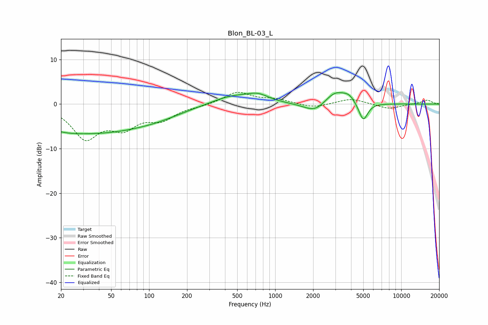

# Blon_BL-03_L
See [usage instructions](https://github.com/jaakkopasanen/AutoEq#usage) for more options and info.

### Parametric EQs
Apply preamp of -2.7 dB when using parametric equalizer.

|   # | Type    |   Fc (Hz) |    Q |   Gain (dB) |
|-----|---------|-----------|------|-------------|
|   1 | Peaking |        21 | 0.59 |        -5.2 |
|   2 | Peaking |        25 | 0.8  |         1.1 |
|   3 | Peaking |        57 | 0.44 |        -4.2 |
|   4 | Peaking |       121 | 0.74 |        -1   |
|   5 | Peaking |       447 | 0.91 |         1.9 |
|   6 | Peaking |       727 | 1.59 |         1.7 |
|   7 | Peaking |      2099 | 1.55 |        -2.5 |
|   8 | Peaking |      3005 | 1.48 |         3.4 |
|   9 | Peaking |      3857 | 3.39 |         1.1 |
|  10 | Peaking |      4998 | 3.92 |        -4.2 |

### Fixed Band EQs
When using fixed band (also called graphic) equalizer, apply preamp of **-2.7 dB** (if available) and set gains manually with these parameters.

|   # | Type    |   Fc (Hz) |    Q |   Gain (dB) |
|-----|---------|-----------|------|-------------|
|   1 | Peaking |        31 | 1.41 |        -7.3 |
|   2 | Peaking |        62 | 1.41 |        -4.5 |
|   3 | Peaking |       125 | 1.41 |        -3   |
|   4 | Peaking |       250 | 1.41 |        -0.4 |
|   5 | Peaking |       500 | 1.41 |         2.7 |
|   6 | Peaking |      1000 | 1.41 |         1   |
|   7 | Peaking |      2000 | 1.41 |        -0.9 |
|   8 | Peaking |      4000 | 1.41 |         1.3 |
|   9 | Peaking |      8000 | 1.41 |        -1.1 |
|  10 | Peaking |     16000 | 1.41 |         0.9 |

### Graphs

