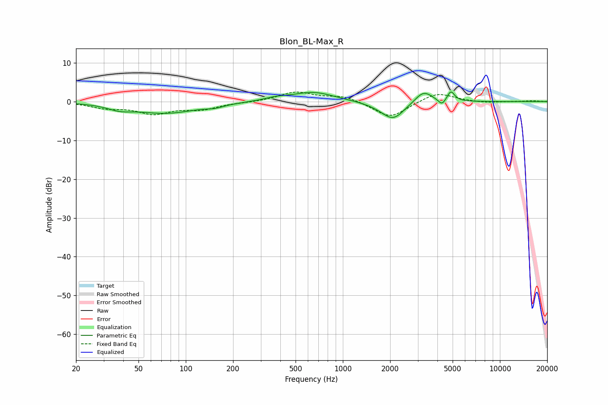

# Blon_BL-Max_R
See [usage instructions](https://github.com/jaakkopasanen/AutoEq#usage) for more options and info.

### Parametric EQs
Apply preamp of -2.6 dB when using parametric equalizer.

|   # | Type    |   Fc (Hz) |    Q |   Gain (dB) |
|-----|---------|-----------|------|-------------|
|   1 | Peaking |        38 | 1.88 |        -1.2 |
|   2 | Peaking |        75 | 0.71 |        -2.9 |
|   3 | Peaking |       153 | 2.69 |        -0.6 |
|   4 | Peaking |       375 | 1.85 |         0.7 |
|   5 | Peaking |       651 | 1.08 |         2.4 |
|   6 | Peaking |      1792 | 1.44 |        -0.6 |
|   7 | Peaking |      2095 | 1.97 |        -4.3 |
|   8 | Peaking |      3263 | 2.54 |         3.1 |
|   9 | Peaking |      4279 | 5.99 |        -1.7 |
|  10 | Peaking |      4870 | 6    |         2.6 |

### Fixed Band EQs
When using fixed band (also called graphic) equalizer, apply preamp of **-2.5 dB** (if available) and set gains manually with these parameters.

|   # | Type    |   Fc (Hz) |    Q |   Gain (dB) |
|-----|---------|-----------|------|-------------|
|   1 | Peaking |        31 | 1.41 |        -1.4 |
|   2 | Peaking |        62 | 1.41 |        -2.8 |
|   3 | Peaking |       125 | 1.41 |        -1.8 |
|   4 | Peaking |       250 | 1.41 |        -0.2 |
|   5 | Peaking |       500 | 1.41 |         2.4 |
|   6 | Peaking |      1000 | 1.41 |         1.5 |
|   7 | Peaking |      2000 | 1.41 |        -4.3 |
|   8 | Peaking |      4000 | 1.41 |         2.5 |
|   9 | Peaking |      8000 | 1.41 |        -0.4 |
|  10 | Peaking |     16000 | 1.41 |         0.2 |

### Graphs

