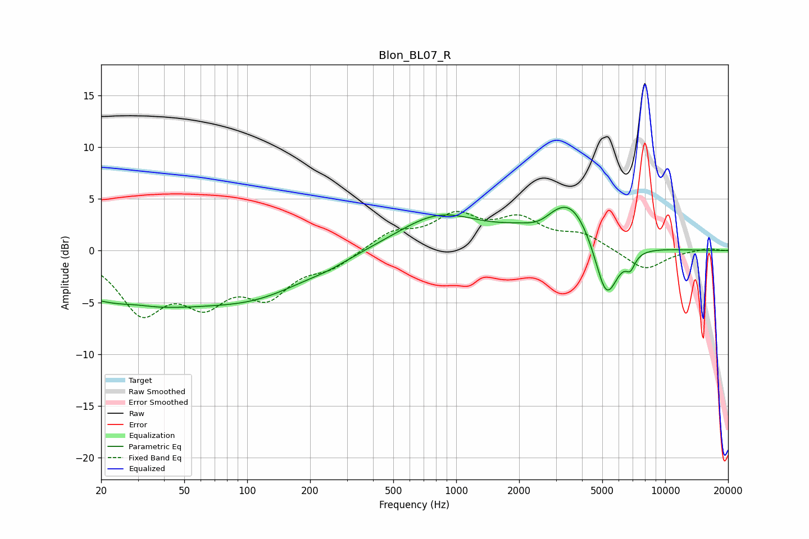

# Blon_BL07_R
See [usage instructions](https://github.com/jaakkopasanen/AutoEq#usage) for more options and info.

### Parametric EQs
Apply preamp of -4.3 dB when using parametric equalizer.

|   # | Type    |   Fc (Hz) |    Q |   Gain (dB) |
|-----|---------|-----------|------|-------------|
|   1 | Peaking |        28 | 0.36 |        -4.9 |
|   2 | Peaking |        30 | 1.82 |         0.3 |
|   3 | Peaking |       115 | 0.56 |        -3.1 |
|   4 | Peaking |       246 | 1.38 |        -0.4 |
|   5 | Peaking |       821 | 0.72 |         3.3 |
|   6 | Peaking |      2535 | 1.77 |        -1.6 |
|   7 | Peaking |      3089 | 0.9  |         4.1 |
|   8 | Peaking |      3656 | 1.53 |         1.7 |
|   9 | Peaking |      5226 | 2.41 |        -6.3 |
|  10 | Peaking |      6819 | 6    |        -1.3 |

### Fixed Band EQs
When using fixed band (also called graphic) equalizer, apply preamp of **-3.9 dB** (if available) and set gains manually with these parameters.

|   # | Type    |   Fc (Hz) |    Q |   Gain (dB) |
|-----|---------|-----------|------|-------------|
|   1 | Peaking |        31 | 1.41 |        -5.5 |
|   2 | Peaking |        62 | 1.41 |        -4.2 |
|   3 | Peaking |       125 | 1.41 |        -3.8 |
|   4 | Peaking |       250 | 1.41 |        -1.4 |
|   5 | Peaking |       500 | 1.41 |         1.7 |
|   6 | Peaking |      1000 | 1.41 |         3   |
|   7 | Peaking |      2000 | 1.41 |         2.7 |
|   8 | Peaking |      4000 | 1.41 |         1.4 |
|   9 | Peaking |      8000 | 1.41 |        -1.9 |
|  10 | Peaking |     16000 | 1.41 |         0.2 |

### Graphs

