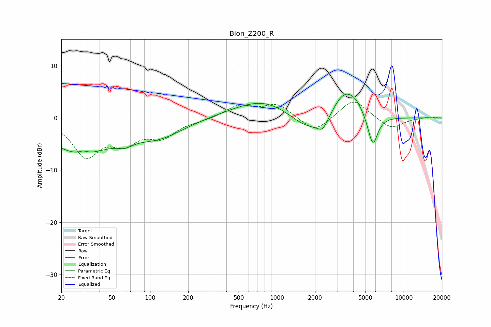

# Blon_Z200_R
See [usage instructions](https://github.com/jaakkopasanen/AutoEq#usage) for more options and info.

### Parametric EQs
Apply preamp of -4.7 dB when using parametric equalizer.

|   # | Type    |   Fc (Hz) |    Q |   Gain (dB) |
|-----|---------|-----------|------|-------------|
|   1 | Peaking |        28 | 0.56 |        -6.5 |
|   2 | Peaking |        30 | 4.32 |         0.6 |
|   3 | Peaking |        63 | 2.34 |        -1.1 |
|   4 | Peaking |       119 | 0.72 |        -3.1 |
|   5 | Peaking |       817 | 0.58 |         3.9 |
|   6 | Peaking |      1767 | 0.9  |        -3.8 |
|   7 | Peaking |      2297 | 3.3  |        -2.2 |
|   8 | Peaking |      3340 | 1.56 |         4.6 |
|   9 | Peaking |      4145 | 1.97 |         2.1 |
|  10 | Peaking |      5706 | 3.47 |        -6.1 |

### Fixed Band EQs
When using fixed band (also called graphic) equalizer, apply preamp of **-3.1 dB** (if available) and set gains manually with these parameters.

|   # | Type    |   Fc (Hz) |    Q |   Gain (dB) |
|-----|---------|-----------|------|-------------|
|   1 | Peaking |        31 | 1.41 |        -7   |
|   2 | Peaking |        62 | 1.41 |        -3.9 |
|   3 | Peaking |       125 | 1.41 |        -3.3 |
|   4 | Peaking |       250 | 1.41 |        -0.4 |
|   5 | Peaking |       500 | 1.41 |         2.3 |
|   6 | Peaking |      1000 | 1.41 |         2.6 |
|   7 | Peaking |      2000 | 1.41 |        -2.9 |
|   8 | Peaking |      4000 | 1.41 |         3.8 |
|   9 | Peaking |      8000 | 1.41 |        -2.2 |
|  10 | Peaking |     16000 | 1.41 |         0.3 |

### Graphs

