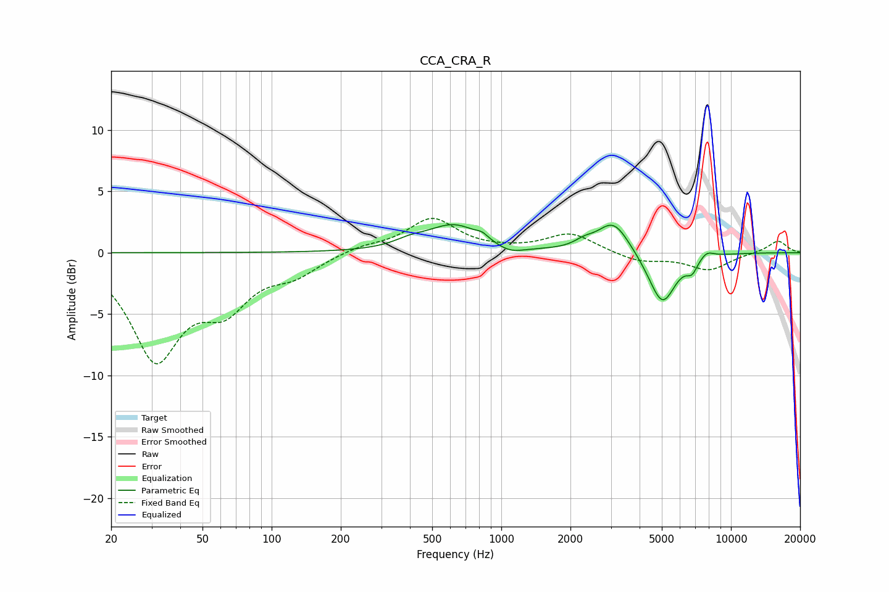

# CCA_CRA_R
See [usage instructions](https://github.com/jaakkopasanen/AutoEq#usage) for more options and info.

### Parametric EQs
Apply preamp of -2.4 dB when using parametric equalizer.

|   # | Type    |   Fc (Hz) |    Q |   Gain (dB) |
|-----|---------|-----------|------|-------------|
|   1 | Peaking |       401 | 2.03 |         0.5 |
|   2 | Peaking |       623 | 1.22 |         2.2 |
|   3 | Peaking |       826 | 5.56 |         0.4 |
|   4 | Peaking |      1089 | 2.35 |        -0.6 |
|   5 | Peaking |      2294 | 3.33 |         0.5 |
|   6 | Peaking |      3081 | 2.03 |         2.6 |
|   7 | Peaking |      4637 | 2.05 |        -0.5 |
|   8 | Peaking |      5049 | 2.47 |        -3.8 |
|   9 | Peaking |      6765 | 5.5  |        -1   |
|  10 | Peaking |      7840 | 4.31 |         0.6 |

### Fixed Band EQs
When using fixed band (also called graphic) equalizer, apply preamp of **-2.9 dB** (if available) and set gains manually with these parameters.

|   # | Type    |   Fc (Hz) |    Q |   Gain (dB) |
|-----|---------|-----------|------|-------------|
|   1 | Peaking |        31 | 1.41 |        -8.3 |
|   2 | Peaking |        62 | 1.41 |        -3.7 |
|   3 | Peaking |       125 | 1.41 |        -1.5 |
|   4 | Peaking |       250 | 1.41 |         0.5 |
|   5 | Peaking |       500 | 1.41 |         2.7 |
|   6 | Peaking |      1000 | 1.41 |         0.1 |
|   7 | Peaking |      2000 | 1.41 |         1.6 |
|   8 | Peaking |      4000 | 1.41 |        -0.7 |
|   9 | Peaking |      8000 | 1.41 |        -1.4 |
|  10 | Peaking |     16000 | 1.41 |         1   |

### Graphs

