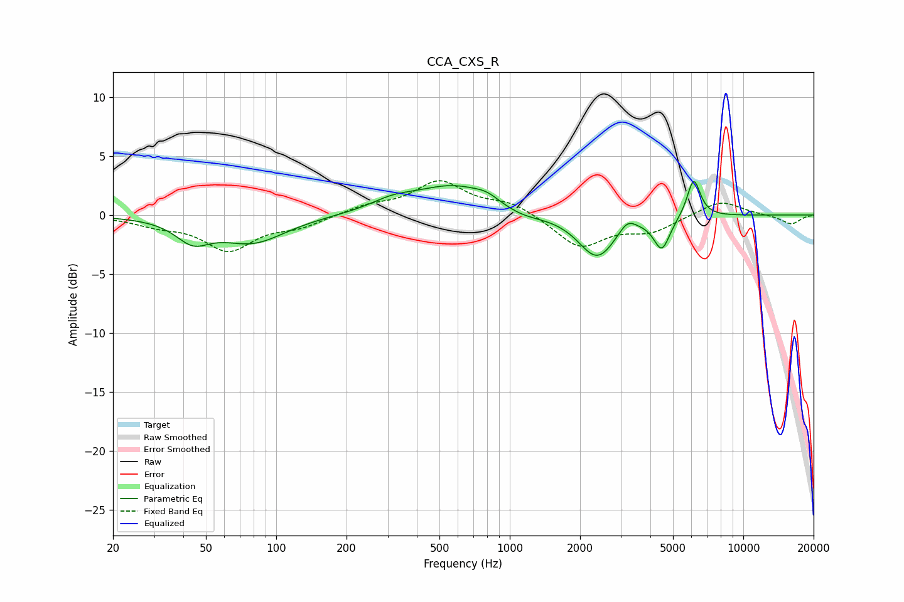

# CCA_CXS_R
See [usage instructions](https://github.com/jaakkopasanen/AutoEq#usage) for more options and info.

### Parametric EQs
Apply preamp of -2.9 dB when using parametric equalizer.

|   # | Type    |   Fc (Hz) |    Q |   Gain (dB) |
|-----|---------|-----------|------|-------------|
|   1 | Peaking |        44 | 1.98 |        -1.8 |
|   2 | Peaking |        79 | 1    |        -2.3 |
|   3 | Peaking |       315 | 1.48 |         0.8 |
|   4 | Peaking |       581 | 0.84 |         2.5 |
|   5 | Peaking |       797 | 2.84 |         0.5 |
|   6 | Peaking |      1128 | 1.51 |        -0.6 |
|   7 | Peaking |      2367 | 1.76 |        -3.7 |
|   8 | Peaking |      3186 | 3.85 |         1   |
|   9 | Peaking |      4481 | 4.04 |        -2.7 |
|  10 | Peaking |      6132 | 4.87 |         3.3 |

### Fixed Band EQs
When using fixed band (also called graphic) equalizer, apply preamp of **-3.0 dB** (if available) and set gains manually with these parameters.

|   # | Type    |   Fc (Hz) |    Q |   Gain (dB) |
|-----|---------|-----------|------|-------------|
|   1 | Peaking |        31 | 1.41 |        -0.7 |
|   2 | Peaking |        62 | 1.41 |        -2.9 |
|   3 | Peaking |       125 | 1.41 |        -0.9 |
|   4 | Peaking |       250 | 1.41 |         0.7 |
|   5 | Peaking |       500 | 1.41 |         2.7 |
|   6 | Peaking |      1000 | 1.41 |         1   |
|   7 | Peaking |      2000 | 1.41 |        -2.7 |
|   8 | Peaking |      4000 | 1.41 |        -1.3 |
|   9 | Peaking |      8000 | 1.41 |         1.3 |
|  10 | Peaking |     16000 | 1.41 |        -0.8 |

### Graphs

