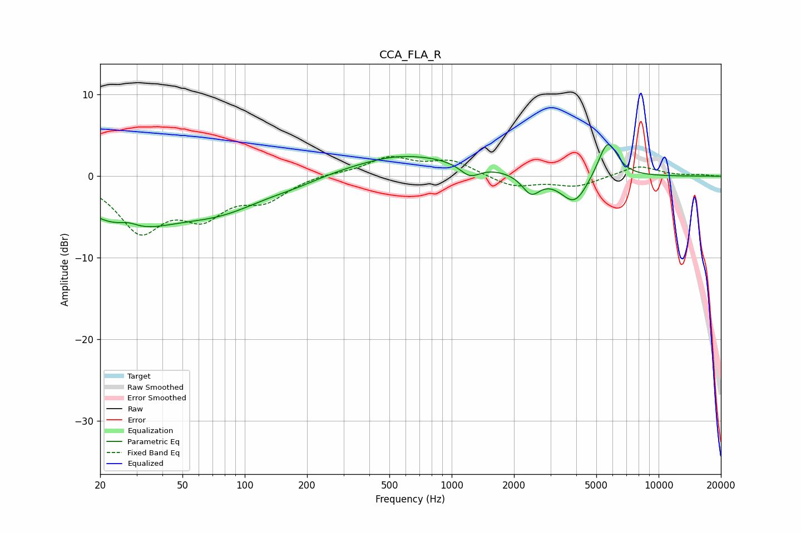

# CCA_FLA_R
See [usage instructions](https://github.com/jaakkopasanen/AutoEq#usage) for more options and info.

### Parametric EQs
Apply preamp of -4.0 dB when using parametric equalizer.

|   # | Type    |   Fc (Hz) |    Q |   Gain (dB) |
|-----|---------|-----------|------|-------------|
|   1 | Peaking |        27 | 0.65 |        -5.6 |
|   2 | Peaking |        27 | 2.72 |         0.9 |
|   3 | Peaking |        76 | 0.62 |        -3.4 |
|   4 | Peaking |       180 | 1.12 |        -0.5 |
|   5 | Peaking |       529 | 1.29 |         0.2 |
|   6 | Peaking |       640 | 0.44 |         2.5 |
|   7 | Peaking |      1223 | 2.89 |        -1.6 |
|   8 | Peaking |      2419 | 3.25 |        -2.3 |
|   9 | Peaking |      3915 | 2.11 |        -3.6 |
|  10 | Peaking |      5674 | 2.93 |         4.7 |

### Fixed Band EQs
When using fixed band (also called graphic) equalizer, apply preamp of **-2.5 dB** (if available) and set gains manually with these parameters.

|   # | Type    |   Fc (Hz) |    Q |   Gain (dB) |
|-----|---------|-----------|------|-------------|
|   1 | Peaking |        31 | 1.41 |        -6.3 |
|   2 | Peaking |        62 | 1.41 |        -4.2 |
|   3 | Peaking |       125 | 1.41 |        -2.6 |
|   4 | Peaking |       250 | 1.41 |         0.3 |
|   5 | Peaking |       500 | 1.41 |         2.2 |
|   6 | Peaking |      1000 | 1.41 |         1.8 |
|   7 | Peaking |      2000 | 1.41 |        -1.3 |
|   8 | Peaking |      4000 | 1.41 |        -1.2 |
|   9 | Peaking |      8000 | 1.41 |         1.3 |
|  10 | Peaking |     16000 | 1.41 |         0.2 |

### Graphs

