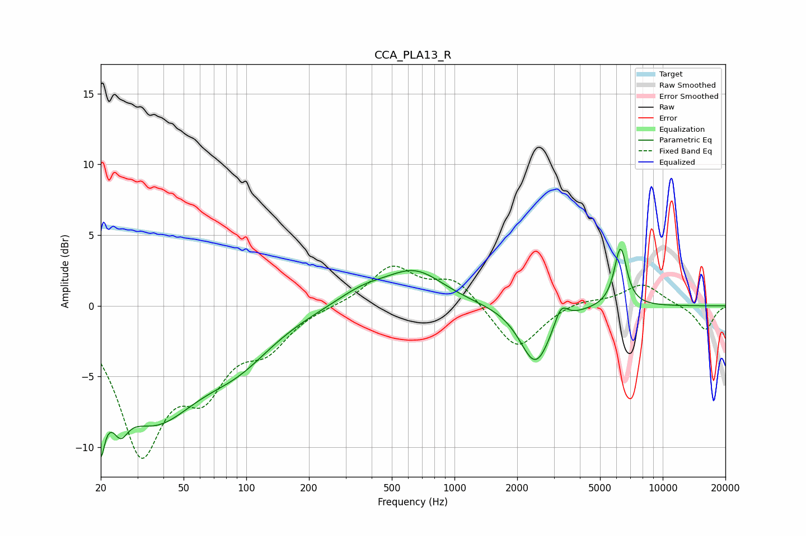

# CCA_PLA13_R
See [usage instructions](https://github.com/jaakkopasanen/AutoEq#usage) for more options and info.

### Parametric EQs
Apply preamp of -4.1 dB when using parametric equalizer.

|   # | Type    |   Fc (Hz) |    Q |   Gain (dB) |
|-----|---------|-----------|------|-------------|
|   1 | Peaking |        20 | 5.62 |        -8.4 |
|   2 | Peaking |        20 | 5.9  |         3.3 |
|   3 | Peaking |        25 | 3.86 |        -2.1 |
|   4 | Peaking |        35 | 0.62 |        -7.6 |
|   5 | Peaking |        92 | 0.83 |        -2.4 |
|   6 | Peaking |       363 | 1.1  |         1   |
|   7 | Peaking |       648 | 1.02 |         2.3 |
|   8 | Peaking |      2450 | 1.93 |        -4.2 |
|   9 | Peaking |      3246 | 4.45 |         1.4 |
|  10 | Peaking |      6271 | 4.58 |         4.2 |

### Fixed Band EQs
When using fixed band (also called graphic) equalizer, apply preamp of **-2.9 dB** (if available) and set gains manually with these parameters.

|   # | Type    |   Fc (Hz) |    Q |   Gain (dB) |
|-----|---------|-----------|------|-------------|
|   1 | Peaking |        31 | 1.41 |        -9.8 |
|   2 | Peaking |        62 | 1.41 |        -4.7 |
|   3 | Peaking |       125 | 1.41 |        -2.5 |
|   4 | Peaking |       250 | 1.41 |         0   |
|   5 | Peaking |       500 | 1.41 |         2.7 |
|   6 | Peaking |      1000 | 1.41 |         1.8 |
|   7 | Peaking |      2000 | 1.41 |        -3.2 |
|   8 | Peaking |      4000 | 1.41 |         0.5 |
|   9 | Peaking |      8000 | 1.41 |         1.6 |
|  10 | Peaking |     16000 | 1.41 |        -1.7 |

### Graphs

