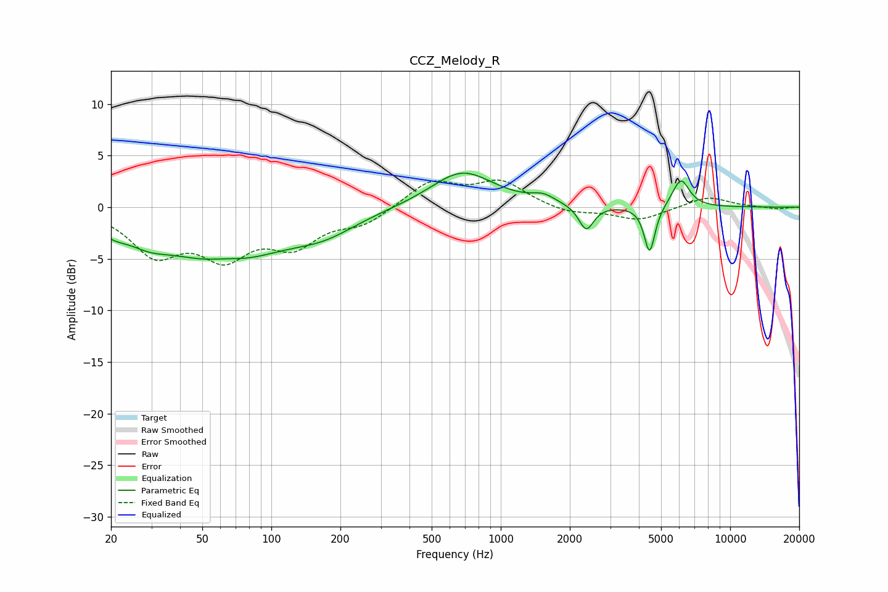

# CCZ_Melody_R
See [usage instructions](https://github.com/jaakkopasanen/AutoEq#usage) for more options and info.

### Parametric EQs
Apply preamp of -3.4 dB when using parametric equalizer.

|   # | Type    |   Fc (Hz) |    Q |   Gain (dB) |
|-----|---------|-----------|------|-------------|
|   1 | Peaking |        20 | 2.32 |        -1   |
|   2 | Peaking |        29 | 1.53 |        -1.3 |
|   3 | Peaking |        62 | 0.55 |        -5.1 |
|   4 | Peaking |        63 | 1.78 |         0.5 |
|   5 | Peaking |       170 | 0.99 |        -1.6 |
|   6 | Peaking |       679 | 1.03 |         3.5 |
|   7 | Peaking |      1531 | 2.78 |         0.7 |
|   8 | Peaking |      2358 | 4.43 |        -2.4 |
|   9 | Peaking |      4456 | 6    |        -4.6 |
|  10 | Peaking |      6096 | 3.73 |         2.8 |

### Fixed Band EQs
When using fixed band (also called graphic) equalizer, apply preamp of **-2.7 dB** (if available) and set gains manually with these parameters.

|   # | Type    |   Fc (Hz) |    Q |   Gain (dB) |
|-----|---------|-----------|------|-------------|
|   1 | Peaking |        31 | 1.41 |        -4.2 |
|   2 | Peaking |        62 | 1.41 |        -4.2 |
|   3 | Peaking |       125 | 1.41 |        -3.3 |
|   4 | Peaking |       250 | 1.41 |        -1.5 |
|   5 | Peaking |       500 | 1.41 |         2.5 |
|   6 | Peaking |      1000 | 1.41 |         2.4 |
|   7 | Peaking |      2000 | 1.41 |        -0.7 |
|   8 | Peaking |      4000 | 1.41 |        -1.3 |
|   9 | Peaking |      8000 | 1.41 |         1.1 |
|  10 | Peaking |     16000 | 1.41 |        -0.2 |

### Graphs

