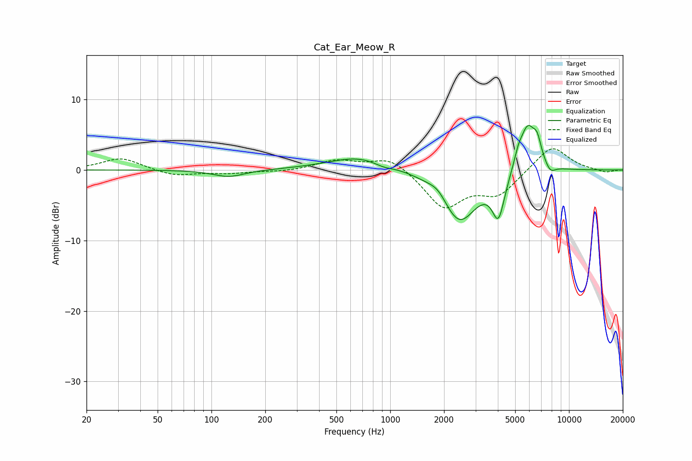

# Cat_Ear_Meow_R
See [usage instructions](https://github.com/jaakkopasanen/AutoEq#usage) for more options and info.

### Parametric EQs
Apply preamp of -6.4 dB when using parametric equalizer.

|   # | Type    |   Fc (Hz) |    Q |   Gain (dB) |
|-----|---------|-----------|------|-------------|
|   1 | Peaking |       125 | 1.59 |        -1   |
|   2 | Peaking |       691 | 0.79 |         2   |
|   3 | Peaking |       913 | 2.46 |        -0.6 |
|   4 | Peaking |      1852 | 2.8  |         1.2 |
|   5 | Peaking |      2432 | 1.4  |        -7.5 |
|   6 | Peaking |      4032 | 4.02 |        -5.8 |
|   7 | Peaking |      5190 | 6    |         1.4 |
|   8 | Peaking |      5876 | 2.89 |         6.7 |
|   9 | Peaking |      6652 | 6    |         2.3 |
|  10 | Peaking |      7852 | 4.66 |        -1.2 |

### Fixed Band EQs
When using fixed band (also called graphic) equalizer, apply preamp of **-3.1 dB** (if available) and set gains manually with these parameters.

|   # | Type    |   Fc (Hz) |    Q |   Gain (dB) |
|-----|---------|-----------|------|-------------|
|   1 | Peaking |        31 | 1.41 |         1.7 |
|   2 | Peaking |        62 | 1.41 |        -0.9 |
|   3 | Peaking |       125 | 1.41 |        -0.4 |
|   4 | Peaking |       250 | 1.41 |        -0.2 |
|   5 | Peaking |       500 | 1.41 |         1.3 |
|   6 | Peaking |      1000 | 1.41 |         1.9 |
|   7 | Peaking |      2000 | 1.41 |        -5.3 |
|   8 | Peaking |      4000 | 1.41 |        -3.3 |
|   9 | Peaking |      8000 | 1.41 |         3.6 |
|  10 | Peaking |     16000 | 1.41 |        -0.4 |

### Graphs

