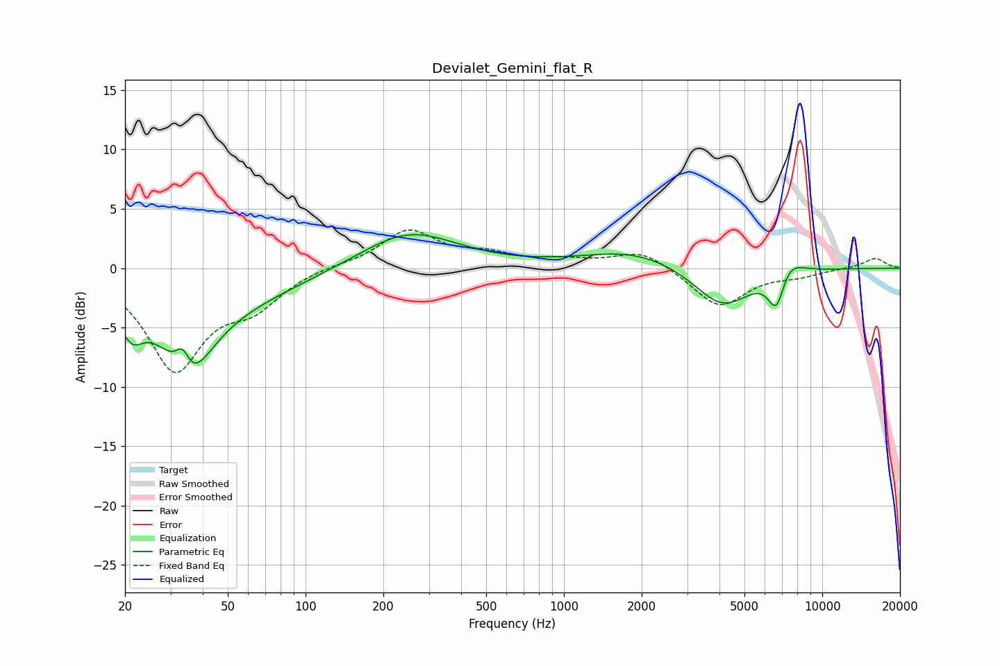

# Devialet_Gemini_flat_R
See [usage instructions](https://github.com/jaakkopasanen/AutoEq#usage) for more options and info.

### Parametric EQs
Apply preamp of -2.9 dB when using parametric equalizer.

|   # | Type    |   Fc (Hz) |    Q |   Gain (dB) |
|-----|---------|-----------|------|-------------|
|   1 | Peaking |        21 | 3.16 |        -2.6 |
|   2 | Peaking |        34 | 4.52 |         3.8 |
|   3 | Peaking |        34 | 3.48 |        -2.3 |
|   4 | Peaking |        35 | 1.46 |        -5.6 |
|   5 | Peaking |        41 | 0.43 |        -2.9 |
|   6 | Peaking |       249 | 0.75 |         3.2 |
|   7 | Peaking |      1874 | 0.71 |         1.5 |
|   8 | Peaking |      4119 | 1.25 |        -3.5 |
|   9 | Peaking |      6658 | 4.01 |        -3.6 |
|  10 | Peaking |      7258 | 2.4  |         1.9 |

### Fixed Band EQs
When using fixed band (also called graphic) equalizer, apply preamp of **-3.3 dB** (if available) and set gains manually with these parameters.

|   # | Type    |   Fc (Hz) |    Q |   Gain (dB) |
|-----|---------|-----------|------|-------------|
|   1 | Peaking |        31 | 1.41 |        -8.3 |
|   2 | Peaking |        62 | 1.41 |        -2.7 |
|   3 | Peaking |       125 | 1.41 |         0.3 |
|   4 | Peaking |       250 | 1.41 |         3.1 |
|   5 | Peaking |       500 | 1.41 |         1   |
|   6 | Peaking |      1000 | 1.41 |         0.5 |
|   7 | Peaking |      2000 | 1.41 |         1.5 |
|   8 | Peaking |      4000 | 1.41 |        -3.3 |
|   9 | Peaking |      8000 | 1.41 |        -0.5 |
|  10 | Peaking |     16000 | 1.41 |         0.9 |

### Graphs

