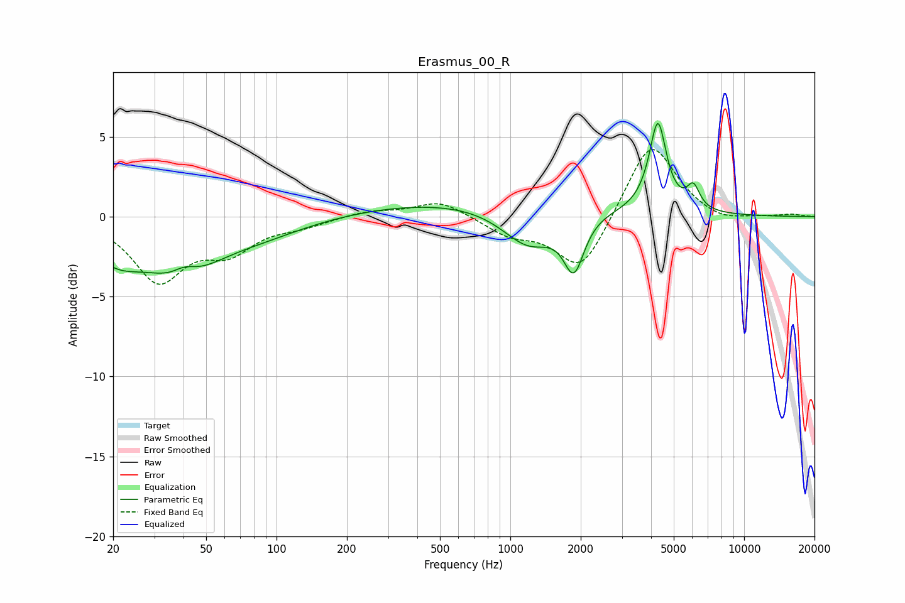

# Erasmus_00_R
See [usage instructions](https://github.com/jaakkopasanen/AutoEq#usage) for more options and info.

### Parametric EQs
Apply preamp of -5.9 dB when using parametric equalizer.

|   # | Type    |   Fc (Hz) |    Q |   Gain (dB) |
|-----|---------|-----------|------|-------------|
|   1 | Peaking |        20 | 1.22 |        -2   |
|   2 | Peaking |        39 | 0.93 |        -3.1 |
|   3 | Peaking |        40 | 2.61 |         0.8 |
|   4 | Peaking |        84 | 0.67 |        -1   |
|   5 | Peaking |       787 | 0.26 |         1.1 |
|   6 | Peaking |      1201 | 1.2  |        -2.6 |
|   7 | Peaking |      1870 | 3.26 |        -3.3 |
|   8 | Peaking |      4219 | 2.49 |         1.3 |
|   9 | Peaking |      4281 | 4.41 |         4.3 |
|  10 | Peaking |      6065 | 5.11 |         1.4 |

### Fixed Band EQs
When using fixed band (also called graphic) equalizer, apply preamp of **-4.3 dB** (if available) and set gains manually with these parameters.

|   # | Type    |   Fc (Hz) |    Q |   Gain (dB) |
|-----|---------|-----------|------|-------------|
|   1 | Peaking |        31 | 1.41 |        -3.9 |
|   2 | Peaking |        62 | 1.41 |        -1.9 |
|   3 | Peaking |       125 | 1.41 |        -0.5 |
|   4 | Peaking |       250 | 1.41 |         0.4 |
|   5 | Peaking |       500 | 1.41 |         1   |
|   6 | Peaking |      1000 | 1.41 |        -1   |
|   7 | Peaking |      2000 | 1.41 |        -3.5 |
|   8 | Peaking |      4000 | 1.41 |         4.9 |
|   9 | Peaking |      8000 | 1.41 |        -0.4 |
|  10 | Peaking |     16000 | 1.41 |         0.1 |

### Graphs

